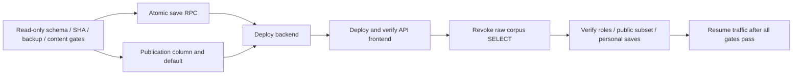

# Production Migration Rollout Readiness — 2026-09-05

> Evidence provenance: Sections 1–12 preserve the Round H observations and planning. They are **HISTORICAL EVIDENCE for Round H-R**, even where the original text says “current.” The **Evidence Closure — Round H-R** section below is the authority for this round's CURRENTLY VERIFIED / NOT VERIFIED / BLOCKED states. No previous database snapshot or test run is represented as newly executed.

## 1. Preflight

**APPLY STATUS: NOT READY — production read-only ledger/schema/ACL/11-row readback and backup availability are unavailable; Render deployment SHA is unverified.**

This is a planning-only Round H result. No production migration, SQL, data write, rollback, ledger repair, push, or application change was performed. Findings below distinguish this round's observations from the repository's 2026-09-04 historical evidence.

- Canonical `pwd`: `/Users/yichengchiu/dev/Blabby/blabby`; branch `main`.
- Audited source HEAD and `origin/main`: `88eada001f89597eb7721ea425c6fd4af23edde3`.
- `git ls-remote origin refs/heads/main` independently returned that exact SHA. Initial `git status --short` was empty; `git rev-list --left-right --count origin/main...HEAD` was `0 0` (behind 0, ahead 0). No pre-existing modifications were present.
- [GitHub Actions run 33874015045](https://github.com/Galant1209/blabby/actions/runs/33874015045): completed/success at the audited SHA. `backend-tests` and `migration-replay` succeeded; setup-node pins Node 20 and all six orphan harness commands succeeded.
- [Render health](https://blabby-backend.onrender.com/health): HTTP 200, `status=ok`, `billing_config_ok=true`, observed timestamp `2026-09-05T03:04:03.573615`. The response contains no commit SHA. Render dashboard requires login; the existing browser GitHub session is also logged out. **Render SHA is not proven by health or API availability.**
- [Vercel deployment](https://vercel.com/galants-projects/blabby/8jT1g8DUrPhYSNjXF77EKdMrv3im): UI **Ready, Production, Current**, alias `blabby.vercel.app`, exact source SHA `88eada001f89597eb7721ea425c6fd4af23edde3`; deployment `dpl_8jT1g8DUrPhYSNjXF77EKdMrv3im`. This proves the production alias is assigned; no promote action was taken. The connector's empty projects/404 were not treated as deployment absence; the authenticated dashboard supplied the evidence.
- HTTP GETs of `/upgrade.html`, `/admin.html`, `/writing.html`, `/task1-chart-renderer.js` returned 200 and matched the corresponding local `frontend/app/` files byte-for-byte. `/app/...` is not the deployed path (initial probe returned 404; corrected to the root paths).
- Anonymous `GET /admin/writing/task1-review`: **401**. `/openapi.json` contains the review GET route. No authenticated review GET or production PATCH was performed.

| Production asset | SHA-256, also equal to audited local file |
|---|---|
| upgrade.html | `81c55d34954a324e6fb38ea97db439acfabf8910b45e6c8cf6c459da7437932b` |
| admin.html | `1e1f7b2781699ec10610488307c7fb39c6c5fffaf3f90b980579b640d35e1c08` |
| writing.html | `93d3543686251043382ff3495f3c5b0b247ca7e5111a2e1768cb0b0def7e611c` |
| task1-chart-renderer.js | `69ec31eb4af9b97e270f65733a94f8aea3b31ef808cfc3991bdc770655f783cf` |

## 2. Exact migration inventory

Fresh filesystem/manifest enumeration: **37 SQL files, 32 forward-replay files including two baselines, 5 rollback files**. The narrative in `SCHEMA_MIGRATION_TRUTH.md` still says 36/31: it predates B. This report uses the actual files and manifest, without changing the historical record.

`supabase/replay/replay.sh` sorts filenames and excludes `*_rollback.sql`. That is a disposable-database test runner, **not a production rollout command**. Its lexical order puts B before A; this does not establish a dependency or authorize either migration. Git provenance: A entered in `9615d8d`, B in `562b88e`; both are ancestors of the audited main.

**No migration is certified `PENDING_BLABBY` or currently `ALREADY_IN_PRODUCTION` in this round**, because the mandatory current production readback is unavailable. A/B remain candidates, not an authorized apply set. `UNKNOWN_REQUIRES_INVESTIGATION` must not be converted to pending from ledger assumptions. `REPO_ONLY_NOT_AUTHORIZED` below is an exclusion decision, not a claim that the corresponding schema is absent.

| Exact repository file | Round H classification | Production ledger | Schema state |
|---|---|---|---|
| `00000000_baseline_from_production.sql` | `REPO_ONLY_NOT_AUTHORIZED` | Unverified; rollback/non-ledger source | Historical early/baseline source; no current parity proof |
| `00000001_baseline_user_lookup_view.sql` | `REPO_ONLY_NOT_AUTHORIZED` | Unverified; rollback/non-ledger source | Historical early/baseline source; no current parity proof |
| `20260429_add_drill_metadata_to_questions.sql` | `REPO_ONLY_NOT_AUTHORIZED` | Unverified; rollback/non-ledger source | Historical early/baseline source; no current parity proof |
| `20260429_create_drill_usage.sql` | `REPO_ONLY_NOT_AUTHORIZED` | Unverified; rollback/non-ledger source | Historical early/baseline source; no current parity proof |
| `20260501_add_get_admin_user_activity.sql` | `REPO_ONLY_NOT_AUTHORIZED` | Unverified; rollback/non-ledger source | Historical early/baseline source; no current parity proof |
| `20260501_add_get_admin_users_full.sql` | `REPO_ONLY_NOT_AUTHORIZED` | Unverified; rollback/non-ledger source | Historical early/baseline source; no current parity proof |
| `20260501_add_get_user_id_by_email.sql` | `REPO_ONLY_NOT_AUTHORIZED` | Unverified; rollback/non-ledger source | Historical early/baseline source; no current parity proof |
| `20260501_separate_paid_vs_granted_pro.sql` | `REPO_ONLY_NOT_AUTHORIZED` | Unverified; rollback/non-ledger source | Historical early/baseline source; no current parity proof |
| `20260501_update_get_admin_users_full_for_grant.sql` | `REPO_ONLY_NOT_AUTHORIZED` | Unverified; rollback/non-ledger source | Historical early/baseline source; no current parity proof |
| `20260507_vocabulary.sql` | `REPO_ONLY_NOT_AUTHORIZED` | Unverified; rollback/non-ledger source | Historical early/baseline source; no current parity proof |
| `20260508_diagnosis_cache.sql` | `REPO_ONLY_NOT_AUTHORIZED` | Unverified; rollback/non-ledger source | Historical early/baseline source; no current parity proof |
| `20260508_quality_grade.sql` | `REPO_ONLY_NOT_AUTHORIZED` | Unverified; rollback/non-ledger source | Historical column present/index missing; strictly excluded |
| `20260508_subscriptions.sql` | `REPO_ONLY_NOT_AUTHORIZED` | Unverified; rollback/non-ledger source | Historical early/baseline source; no current parity proof |
| `20260515_part2_prep_notes.sql` | `REPO_ONLY_NOT_AUTHORIZED` | Unverified; rollback/non-ledger source | Historical early/baseline source; no current parity proof |
| `20260515_pro_grant_expiry.sql` | `REPO_ONLY_NOT_AUTHORIZED` | Unverified; rollback/non-ledger source | Historical early/baseline source; no current parity proof |
| `20260518_reading_band_updated_at.sql` | `REPO_ONLY_NOT_AUTHORIZED` | Unverified; rollback/non-ledger source | Historical early/baseline source; no current parity proof |
| `20260518_reading_module.sql` | `REPO_ONLY_NOT_AUTHORIZED` | Unverified; rollback/non-ledger source | Historical early/baseline source; no current parity proof |
| `20260518_reading_vocab_targets.sql` | `REPO_ONLY_NOT_AUTHORIZED` | Unverified; rollback/non-ledger source | Historical early/baseline source; no current parity proof |
| `20260519_reading_passages_created_by.sql` | `REPO_ONLY_NOT_AUTHORIZED` | Unverified; rollback/non-ledger source | Historical early/baseline source; no current parity proof |
| `20260617120832_create_rec_log_table.sql` | `UNKNOWN_REQUIRES_INVESTIGATION` | Unverified; historical mapped ledger entry | Historical schema present; no Round H readback |
| `20260618040300_create_writing_module_tables.sql` | `UNKNOWN_REQUIRES_INVESTIGATION` | Unverified; historical mapped ledger entry | Historical schema present; no Round H readback |
| `20260618045448_writing_questions_add_svg_pregen.sql` | `UNKNOWN_REQUIRES_INVESTIGATION` | Unverified; historical mapped ledger entry | Historical schema present; no Round H readback |
| `20260630033125_add_retry_of_to_practice_records.sql` | `UNKNOWN_REQUIRES_INVESTIGATION` | Unverified; historical mapped ledger entry | Historical schema present; no Round H readback |
| `20260714_p1_rls_and_reading_answers.sql` | `UNKNOWN_REQUIRES_INVESTIGATION` | Unverified; historical mapped ledger entry | Historical schema present; no Round H readback |
| `20260726_billing_identity_containment.sql` | `REPO_ONLY_NOT_AUTHORIZED` | Unverified; rollback/non-ledger source | Historical partial parity; cannot replay wholesale |
| `20260726_billing_identity_containment_rollback.sql` | `REPO_ONLY_NOT_AUTHORIZED` | Unverified; rollback/non-ledger source | Rollback planning source; not forward |
| `20260730_0_is_user_pro_reconciliation.sql` | `UNKNOWN_REQUIRES_INVESTIGATION` | Unverified; historical mapped ledger entry | Historical schema present; no Round H readback |
| `20260730_0_is_user_pro_reconciliation_rollback.sql` | `REPO_ONLY_NOT_AUTHORIZED` | Unverified; rollback/non-ledger source | Rollback planning source; not forward |
| `20260730_ecpay_backend.sql` | `UNKNOWN_REQUIRES_INVESTIGATION` | Unverified; historical mapped ledger entry | Historical schema present; no Round H readback |
| `20260730_ecpay_backend_rollback.sql` | `REPO_ONLY_NOT_AUTHORIZED` | Unverified; rollback/non-ledger source | Rollback planning source; not forward |
| `20260731_content_access_lockdown.sql` | `UNKNOWN_REQUIRES_INVESTIGATION` | Unverified; historical mapped ledger entry | Historical schema present; no Round H readback |
| `20260731_content_access_lockdown_rollback.sql` | `REPO_ONLY_NOT_AUTHORIZED` | Unverified; rollback/non-ledger source | Rollback planning source; not forward |
| `20260803111937_reading_pool_columns_and_backfill.sql` | `UNKNOWN_REQUIRES_INVESTIGATION` | Unverified; historical mapped ledger entry | Historical schema present; no Round H readback |
| `20260813_anonymous_process_quota.sql` | `REPO_ONLY_NOT_AUTHORIZED` | Unverified; rollback/non-ledger source | Historical schema present despite ledger silence |
| `20260813_anonymous_process_quota_rollback.sql` | `REPO_ONLY_NOT_AUTHORIZED` | Unverified; rollback/non-ledger source | Rollback planning source; not forward |
| `20260904_retire_obsolete_waitlist_exposure.sql` | `UNKNOWN_REQUIRES_INVESTIGATION` | Unverified; 09-04 expected absent | A: historical old exposure |
| `20260904123000_task1_chart_human_review.sql` | `UNKNOWN_REQUIRES_INVESTIGATION` | Unverified; 09-04 expected absent | B: historical expected absent |

## 3. Production ledger truth and access gate

Target project ref in current `frontend/app/config.js`: `mkwywkwruyqzdhuzwnoa`. This validates the intended connection target only; it does not prove the identity of an SQL session.

Current process has no PG/database/Supabase connection variables; canonical repository has no configured `.env` DB connection, and no local `.pgpass`/`.pg_service.conf` was available. The accessible Supabase browser account redirected the intended project URL to an organization listing only other projects. Its organization selector offered no Blabby organization. **No production SQL was submitted.** No service-role REST substitute was used: it cannot satisfy this task's SQL transaction requirement.

| Required live fact | Round H result |
|---|---|
| `current_database()`, `current_user`, transaction mode | NOT OBTAINED; no production SQL session opened |
| `BEGIN; SET TRANSACTION READ ONLY; SHOW transaction_read_only;` | NOT RUN; therefore no production SELECT allowed |
| Live ledger rows, exact versions, statement fingerprints | NOT OBTAINED |
| A policies/grants, B objects, affected table sizes/locks | NOT OBTAINED |
| 11 retired question IDs/serving state and all-row fingerprints | NOT OBTAINED |
| Backup timestamp, status, retention, restore availability | NOT VERIFIED |
| `ROLLBACK` | No production transaction existed to roll back; future runner below always rolls back |

Historical evidence only: `SCHEMA_MIGRATION_TRUTH.md` and its manifest record PostgreSQL 17.6, database/user `postgres`, read-only `on`, 12 ledger entries, and an 887-record catalog snapshot (SHA-256 `4ce44086b553a2a2340dce358a0fb55a25711e0b392827c5f11270907bf13ab`) on 2026-09-04. That is neither a backup nor a Round H snapshot. The old snapshot was catalog-only and cannot prove the 11 live business rows today.

| Historical ledger name (verbatim manifest) | Round H classification | Evidence limit |
|---|---|---|
| `20260617120832_create_rec_log_table` | `UNKNOWN_REQUIRES_INVESTIGATION` | Historical 09-04 only; current version/row unverified |
| `20260618040300_create_writing_module_tables` | `UNKNOWN_REQUIRES_INVESTIGATION` | Historical 09-04 only; current version/row unverified |
| `20260618045448_writing_questions_add_svg_pregen` | `UNKNOWN_REQUIRES_INVESTIGATION` | Historical 09-04 only; current version/row unverified |
| `20260630033125_add_retry_of_to_practice_records` | `UNKNOWN_REQUIRES_INVESTIGATION` | Historical 09-04 only; current version/row unverified |
| `20260714054716_p1_rls_and_reading_answers` | `UNKNOWN_REQUIRES_INVESTIGATION` | Historical 09-04 only; current version/row unverified |
| `20260714054836_p1_rls_and_reading_answers_idempotency_recheck` | `UNKNOWN_REQUIRES_INVESTIGATION` | Historical 09-04 only; current version/row unverified |
| `20260730061503_content_access_lockdown` | `UNKNOWN_REQUIRES_INVESTIGATION` | Historical 09-04 only; current version/row unverified |
| `20260730071147_is_user_pro_reconciliation` | `UNKNOWN_REQUIRES_INVESTIGATION` | Historical 09-04 only; current version/row unverified |
| `20260730071938_ecpay_backend_schema` | `UNKNOWN_REQUIRES_INVESTIGATION` | Historical 09-04 only; current version/row unverified |
| `20260803111937_reading_pool_columns_and_backfill` | `UNKNOWN_REQUIRES_INVESTIGATION` | Historical 09-04 only; current version/row unverified |
| `create_npc_relations` | `SHARED_OTHER_PROJECT_EXCLUDED` | Historical 09-04 only; current version/row unverified |
| `harden_npc_relations` | `SHARED_OTHER_PROJECT_EXCLUDED` | Historical 09-04 only; current version/row unverified |

The dated source maps repo P1 `20260714_p1_rls_and_reading_answers.sql` to ledger names beginning `20260714054716` and `20260714054836`; repo content lockdown to `20260730061503`, reconciliation to `20260730071147`, and ECPay to `20260730071938`. These differently named applications are a reason to compare ledger statements and schema, not to re-run date-named repo files. Current ledger version fields remain unverified. The Reading reconstructed source is historically mapped to version `20260803111937` with statement MD5 `8127e822b00fbebfa246ecf9ace93c95`.

Required decision matrix for the future readback:

| Ledger | Expected schema | Decision |
|---|---|---|
| Present, matching exact source | Present and matching | ALREADY_IN_PRODUCTION; do not apply again |
| Absent | Present and matching | Schema already present; do not apply or repair ledger; investigate provenance |
| Absent | Absent / A still has old exposure | Only after identity, exact source, dependency and backup gates: PENDING_BLABBY candidate |
| Present | Missing or mismatched | UNKNOWN_REQUIRES_INVESTIGATION; stop |
| Unknown | Any | UNKNOWN_REQUIRES_INVESTIGATION; stop |

**Ledger absence ≠ schema absence.** Inspect schema even when the filename/version is absent. Do not query business data for `gmail_*`, `omg_*`, `npc_*`; their ledger metadata can be classified without expanding the rollout.

## 4. Migration A — impact and risks

Exact file: `supabase/migrations/20260904_retire_obsolete_waitlist_exposure.sql`.
SHA-256: `c0608cb44464a956496bd709487721fa91f25047eee3ada99507babd7bf763ce`.

Line review:

- Lines 1–6 explain historical-data retention and missing-table defense.
- Lines 7–11 enter one DO statement and return when `public.upgrade_intent` does not exist. A successful no-op must not be mislabeled as removing exposure from an existing table.
- Line 13 drops `allow_anon_insert` (historical baseline: INSERT to anon **and authenticated**, `WITH CHECK (true)`).
- Line 14 drops `anon_insert_upgrade_intent` (anon INSERT).
- Line 15 drops `authenticated_insert_upgrade_intent` (authenticated INSERT).
- Line 16 revokes only table-level INSERT from `anon`. It does not revoke all anon privileges, column-specific INSERT grants, PUBLIC grants, inherited grants, or authenticated/service-role privileges.
- Lines 17–18 finish the DO block. All four operations are one atomic SQL statement. Missing policies and absent privilege grants are safe to re-run; the missing-table guard is reviewed and complete-file rerun behavior is verified locally, not presumed production parity.

The table, every historical row, `allow_owner_select`, all other policies, RLS setting, indexes and RPCs remain. Under the historical policy set, authenticated INSERT becomes denied by RLS even though its table grant is unchanged; **authenticated behavior is affected**. Authenticated owner SELECT should remain. Service-role behavior should remain if its current grants and BYPASSRLS are confirmed. Effective anon access requires checking column/PUBLIC/inherited grants and remaining policies too; the one REVOKE alone is not sufficient evidence.

No row deletion/rewrite is requested. Policy changes take a table lock and can wait behind active work; plan a short `lock_timeout` and an explicit transaction. Unknown extra policies/ACL drift block apply, rather than broadening A to remove them automatically. Rollback can reopen obsolete public writes and needs separate authorization.

Fresh dependency search across `frontend`, `backend/main.py`, tests and migrations:

| Search target | Current result |
|---|---|
| `upgrade_intent` | No frontend waitlist write; backend only references it in admin user cleanup at lines 6282–6284. Historical `get_admin_users_full` SQL still reads its emails. Keep table/data. |
| `pro_waitlist` | No current frontend/backend call; historical baseline remains. No physical drop. |
| `upgrade_interest`, `/api/track/upgrade_page_view`, `/api/track/upgrade_interest` | Absent from live frontend/backend source; negative tests retain the names. |
| `/admin/waitlist`, `/admin/pro_breakdown`, `/admin/dashboard`, `/admin/activity` | Removed from backend source; historical comments/SQL names are not live routes. |
| Upgrade / checkout | Current upgrade frontend has no `upgrade_intent` write; billing contracts and the 25-assertion Node harness pass. Production upgrade asset equals source. No checkout/payment was initiated. |

A and B have **NO ORDERING DEPENDENCY**.

## 5. Migration B — impact and serving-state safety

Exact file: `supabase/migrations/20260904123000_task1_chart_human_review.sql`.
SHA-256: `5793d823c6bf1f7499beccee8c84d32b620c87ab221e3ecc1190134c05321052`.

| Lines / object | Definition and existing-row behavior |
|---|---|
| 8–13, `writing_questions` | Adds five columns with IF NOT EXISTS. Applies to all task types, not only Task 1. |
| `review_status` | text, NOT NULL, constant default `pending`; existing rows read as pending. |
| `review_issue`, `review_note` | nullable text, no explicit default (NULL). |
| `reviewed_at` | nullable timestamptz, no explicit default (NULL). |
| `reviewed_by` | nullable uuid, no explicit default (NULL), **no FK**. API supplies the authenticated admin identity. |
| 15–49, status CHECK | `writing_questions_review_status_check`: pending / approved / needs_fix / retired. |
| 29–47, issue CHECK | NULL or renderer_unsupported / data_shape_invalid / misleading_visual / label_collision / unreadable / content_issue / other. |
| 51–52, index | Non-unique btree `idx_writing_questions_review_status(task_type, review_status, created_at)`; ordinary CREATE INDEX, not CONCURRENTLY. |

No table, FK, unique constraint, policy, grant or trigger is added. Existing table RLS/ACLs continue to govern the new columns, so actual production permissions must be inspected before treating metadata as admin-only. Name-based IF NOT EXISTS guards do not validate an existing column/constraint/index definition; partial or conflicting objects require investigation.

On PostgreSQL 17, a constant-default added column avoids a full table rewrite, but CHECK validation scans existing rows. ALTER TABLE uses ACCESS EXCLUSIVE here; the ordinary index build also blocks writers, and an explicit transaction retains its strongest lock until commit. The file has **no outer BEGIN/COMMIT**: future apply must wrap the complete file in a single transaction to prevent columns remaining after a later failure. Row count, bytes, long transactions and blockers have not been measured in production. [PostgreSQL 17 ALTER TABLE](https://www.postgresql.org/docs/17/sql-altertable.html).

**Review state ≠ Serving state.** B contains no data UPDATE, serving-state default change or trigger. Its `retired` review status also does not perform soft retirement. `Task1ReviewPatch` forbids extra fields; the PATCH handler changes only review_status/review_issue/review_note and server-derived reviewed_at/reviewed_by. `is_pregenerated`, chart source, prompt, used_count and submission data are not updated. `test_approved_review_does_not_reactivate_retired_question` confirms approved leaves the retired fixture's serving flag false. It does not prove the 11 production rows, which must be re-read.

Current backend GET explicitly selects the new columns; a `.get(..., 'pending')` fallback in response formatting does **not** make a missing database column safe. Missing B can cause authenticated review GET/PATCH to fail (503). Frontend review assets are already deployed, and the backend route exists, but the current authenticated schema-backed behavior is unverified. B must exist before enabling real review use. No renderer or multi-period pie change is needed. `review_status: null` is accepted by the optional request model but violates B's NOT NULL constraint; future contract verification should treat this as an invalid input, not a supported review state. No unrelated API fix is included here.

## 6. Excluded migrations and operations

- `create_npc_relations`, `harden_npc_relations`, and any gmail/omg/npc domain migration: **SHARED_OTHER_PROJECT_EXCLUDED**. Do not apply, copy, drop or reconcile their business objects.
- `20260508_quality_grade.sql`: **REPO_ONLY_NOT_AUTHORIZED**. Historical `quality_grade` column presence and missing `practice_records_quality_grade_idx` are distinct facts. Only identify/classify the index; no production create/drop/rebuild, file edit, or repair is authorized.
- All baselines, earlier source reconstructions, ledger-silent billing/quota sources and five rollback files: excluded from the candidate apply list. No ledger repair, “run all pending,” wildcard migration runner or baseline replay in production.
- No `pro_waitlist` physical drop, product-definition change, streak, XP, gamification, multi-period pie renderer, or `backend/main.py` refactor.

## 7. Proposed rollout order — NOT EXECUTED

**NO ORDERING DEPENDENCY** between A and B: they touch different tables and neither creates a prerequisite for the other.

1. **STEP 1 — close readiness blockers.** Restore an approved production SQL session, prove READ ONLY, snapshot ledger/ACL/schema/11 IDs, confirm backup and Render exact SHA. Reclassify A/B from current evidence. Freeze exact file hashes and candidate ledger versions/names; stop for unexpected objects or ledger collisions.
2. **STEP 2 — obtain Galant authorization** for the final concrete allowlist, target, maintenance window, transaction/ledger method, timeouts and rollback plan. This report grants no apply authority.
3. **STEP 3 — proposed B first**, because the deployed review UI/backend route already depend on its columns. In the later authorized run, wrap the complete B file plus its precisely defined migration-ledger operation atomically using an approved mechanism; verify B and protected-row invariants before any review save. Choosing B first is operational preference, not dependency.
4. **STEP 4 — proposed A independently**, only after checking deployed paths still do not write waitlists and capturing exact ACL/policy restoration material. Verify privileges, owner SELECT and historical-row fingerprints before proceeding.
5. **STEP 5 — complete post-apply verification** and archive before/after evidence. No redeploy is inherently required for this audited frontend source; confirm Render source parity. For a fresh environment the sequencing is B schema → review backend → review UI. A follows retirement of the obsolete application writes (already removed in audited source).

If either is already represented in schema, remove it from the apply proposal and investigate ledger silence rather than replaying it. A/B candidate file-derived versions are `20260904` / `20260904123000`, with descriptive names `retire_obsolete_waitlist_exposure` / `task1_chart_human_review`. They are **proposals, not observed ledger values**. The final tooling must resolve its naming convention and guarantee exactly the approved ledger rows; neither SQL file writes the ledger itself.

## 8. Executable pre-apply checklist

- [ ] HEAD equals freshly fetched `origin/main`, branch is main, and working tree is clean. Run `git status --short`, `git rev-parse HEAD`, `git rev-parse origin/main`, `git ls-remote origin refs/heads/main`, `git rev-list --left-right --count origin/main...HEAD`. No reset/clean/stash or overwrite.
- [ ] Exact expected SHA has successful backend-tests, migration-replay, frontend harness jobs; Node 20. Local equivalent: `node --version`; `python -m pytest backend/tests -q`; explicitly run the six `.mjs` commands in `.github/workflows/test.yml` plus billing harness. Replay only in a newly created local PostgreSQL 17 database.
- [ ] Render health 200 **and authenticated Render deployed SHA** equal expected source; Vercel Ready/Current production alias source equals expected SHA. HTTP 200 is not SHA parity.
- [ ] Backup control plane confirms a successful recoverable backup: project, completed timestamp, retention, restoration permissions and recovery method. Do not treat a schema JSON, a enabled-setting screenshot, or a scheduled future backup as availability. No backup creation or restore in this round.
- [ ] Approved connection matches `mkwywkwruyqzdhuzwnoa`; read-only gate and identity recorded. Database/user must be checked against the approved target; historical `postgres/postgres` is not sufficient project identity.
- [ ] Ledger snapshot includes every version/name and source-statement fingerprint. Compare both names and versions; explicitly classify other-project entries.
- [ ] A table/rows, exact policies (command/roles/permissiveness/USING/WITH CHECK), table and column ACLs including PUBLIC and grant options, role membership/BYPASSRLS; B columns/constraints/index/RLS/triggers, all-writing protected fingerprints and 11 exact retired IDs are recorded. Check index size/table bytes and active transactions/locks for both affected tables.
- [ ] B has no unexpected pre-existing metadata definitions or serving-changing triggers; current anon/authenticated grants do not expose review metadata contrary to the intended admin API boundary.
- [ ] Candidate allowlist only after reclassification: exact files and hashes below. **Authorized apply allowlist right now: EMPTY.**

```text
supabase/migrations/20260904_retire_obsolete_waitlist_exposure.sql
  sha256 c0608cb44464a956496bd709487721fa91f25047eee3ada99507babd7bf763ce
supabase/migrations/20260904123000_task1_chart_human_review.sql
  sha256 5793d823c6bf1f7499beccee8c84d32b620c87ab221e3ecc1190134c05321052
```

- [ ] Exact ledger version/name plan has no collision and will be atomic with each migration; no manual silent ledger backfill.
- [ ] Short proposed `lock_timeout=5s`, `statement_timeout=60s` are reviewed against measured table size and maintenance window. A timeout is a rollback/stop, not permission to increase it blindly. Validate complete-file atomicity and retain rollback material.
- [ ] Document's local-only commit has been separately authorized/pushed and CI/deploy parity re-established if it becomes the apply HEAD. Round H intentionally leaves main ahead by its docs commit, so HEAD/origin parity will need refreshing later.

### Read-only snapshot runner for a future authorized inspection

The following Python/psycopg runner is **prepared, not executed against production**. Use an already provisioned secure local `BLABBY_PRODUCTION_DSN`, never paste secrets into chat or commit them. Configure SSL verification according to the approved connection. Verify host/user target before connecting. This runner checks transaction mode before any SELECT and executes ROLLBACK in finally, including on a failed query. Keep the JSON private; it contains schema/role metadata and question IDs/fingerprints, not user content.

```python
import json, os, pathlib, sys
import psycopg
from psycopg.conninfo import conninfo_to_dict

QUERIES = [
    ('identity', r"""SELECT current_database() AS database, current_user AS db_user,
       session_user, current_setting('transaction_read_only') AS read_only,
       current_setting('server_version') AS server_version,
       current_setting('supabase.project_ref', true) AS project_ref,
       now() AS captured_at;"""),
    ('ledger', r"""SELECT version, name, cardinality(statements) AS statement_count,
       md5(array_to_string(statements, E'\n')) AS statements_md5
FROM supabase_migrations.schema_migrations ORDER BY version;"""),
    ('tables', r"""SELECT n.nspname, c.relname, c.relkind, c.relrowsecurity, c.relforcerowsecurity,
       pg_get_userbyid(c.relowner) AS owner, c.relacl::text,
       pg_total_relation_size(c.oid) AS total_bytes
FROM pg_class c JOIN pg_namespace n ON n.oid=c.relnamespace
WHERE n.nspname='public' AND c.relname IN ('upgrade_intent','writing_questions');"""),
    ('columns', r"""SELECT table_name,column_name,data_type,udt_name,is_nullable,column_default
FROM information_schema.columns WHERE table_schema='public'
AND table_name IN ('upgrade_intent','writing_questions')
ORDER BY table_name,ordinal_position;"""),
    ('policies', r"""SELECT schemaname,tablename,policyname,permissive,roles,cmd,qual,with_check
FROM pg_policies WHERE schemaname='public'
AND tablename IN ('upgrade_intent','writing_questions') ORDER BY tablename,policyname;"""),
    ('column_acls', r"""SELECT c.relname, a.attname, a.attacl::text
FROM pg_attribute a JOIN pg_class c ON c.oid=a.attrelid
JOIN pg_namespace n ON n.oid=c.relnamespace
WHERE n.nspname='public' AND c.relname IN ('upgrade_intent','writing_questions')
AND a.attnum>0 AND NOT a.attisdropped ORDER BY c.relname,a.attnum;"""),
    ('effective_privileges', r"""SELECT r.rolname,c.relname,
       has_table_privilege(r.oid,c.oid,'SELECT') AS can_select,
       has_table_privilege(r.oid,c.oid,'INSERT') AS can_insert,
       has_table_privilege(r.oid,c.oid,'UPDATE') AS can_update,
       has_table_privilege(r.oid,c.oid,'DELETE') AS can_delete,
       has_any_column_privilege(r.oid,c.oid,'INSERT') AS any_column_insert,
       r.rolsuper,r.rolbypassrls
FROM pg_roles r CROSS JOIN pg_class c JOIN pg_namespace n ON n.oid=c.relnamespace
WHERE r.rolname IN ('anon','authenticated','service_role') AND n.nspname='public'
AND c.relname IN ('upgrade_intent','writing_questions') ORDER BY r.rolname,c.relname;"""),
    ('role_memberships', r"""SELECT pg_get_userbyid(roleid) AS inherited_role,
       pg_get_userbyid(member) AS member,admin_option,inherit_option,set_option
FROM pg_auth_members ORDER BY inherited_role,member;"""),
    ('constraints', r"""SELECT c.relname,k.conname,k.contype,k.convalidated,pg_get_constraintdef(k.oid) AS definition
FROM pg_constraint k JOIN pg_class c ON c.oid=k.conrelid
JOIN pg_namespace n ON n.oid=c.relnamespace WHERE n.nspname='public'
AND c.relname IN ('upgrade_intent','writing_questions') ORDER BY c.relname,k.conname;"""),
    ('indexes', r"""SELECT t.relname AS tablename,i.relname AS indexname,
       x.indisvalid,x.indisready,pg_get_indexdef(x.indexrelid) AS definition
FROM pg_index x JOIN pg_class t ON t.oid=x.indrelid
JOIN pg_class i ON i.oid=x.indexrelid JOIN pg_namespace n ON n.oid=t.relnamespace
WHERE n.nspname='public' AND t.relname IN ('upgrade_intent','writing_questions')
ORDER BY t.relname,i.relname;"""),
    ('triggers', r"""SELECT c.relname,t.tgname,t.tgenabled,pg_get_triggerdef(t.oid) AS definition,
       pg_get_functiondef(t.tgfoid) AS function_definition
FROM pg_trigger t JOIN pg_class c ON c.oid=t.tgrelid
JOIN pg_namespace n ON n.oid=c.relnamespace WHERE n.nspname='public'
AND c.relname IN ('upgrade_intent','writing_questions') AND NOT t.tgisinternal;"""),
    ('upgrade_rows', r"""SELECT count(*) AS rows,
       md5(coalesce(string_agg(md5(to_jsonb(u)::text),'' ORDER BY id),'')) AS rows_md5
FROM public.upgrade_intent u;"""),
    ('writing_protected_rows', r"""SELECT count(*) AS rows,
       md5(coalesce(string_agg(md5((to_jsonb(w)-ARRAY['review_status','review_issue',
         'review_note','reviewed_at','reviewed_by'])::text),'' ORDER BY id),'')) AS protected_rows_md5,
       count(*) FILTER (WHERE is_pregenerated) AS serving_rows
FROM public.writing_questions w;"""),
    ('retired_11', r"""SELECT id,is_pregenerated,
       md5((to_jsonb(w)-ARRAY['review_status','review_issue','review_note',
         'reviewed_at','reviewed_by'])::text) AS protected_row_md5,
       to_jsonb(w)->>'review_status' AS review_status
FROM public.writing_questions w WHERE id IN (
 '491a28c2-4bfa-47f3-8e3b-484695df73d2','3d8d7bc5-915f-4ca2-b343-7fab5461d4fc',
 'ab70b2fd-b96b-435b-81ca-ee7864be2c10','6b3c1090-fca5-48c3-886f-92d25195fb69',
 '85f9e3b7-8695-467c-9cf5-402324f7e6da','642acea1-339d-4f75-a0f0-1eb25afdd32a',
 '2e0a374b-68d2-458f-adca-d5a4a45da0c7','0727e5e7-2749-4a35-8922-92ad99181a2f',
 'ed6a48ea-a177-4661-929c-df51b97e523e','ae202b45-7ad9-4622-8132-b0bd749ebdf6',
 'a4665e22-f250-42c7-9f2f-4c6a77ea2d9c') ORDER BY id;"""),
    ('locks', r"""SELECT a.pid,a.usename,a.state,a.xact_start,l.mode,l.granted,
       c.relname,pg_blocking_pids(a.pid) AS blocked_by
FROM pg_locks l JOIN pg_stat_activity a ON a.pid=l.pid
LEFT JOIN pg_class c ON c.oid=l.relation
WHERE l.relation IN (to_regclass('public.upgrade_intent'),
                     to_regclass('public.writing_questions'))
OR (a.datname=current_database() AND a.xact_start<now()-interval '1 minute');"""),
    ('excluded_index', r"""SELECT to_regclass('public.practice_records_quality_grade_idx') AS excluded_index_identity_only;"""),
]

ref = "mkwywkwruyqzdhuzwnoa"
dsn = os.environ["BLABBY_PRODUCTION_DSN"]
info = conninfo_to_dict(dsn)
host = info.get("host", "")
if not (host == "db." + ref + ".supabase.co" or
        (host.endswith(".pooler.supabase.com") and info.get("user") == "postgres." + ref)):
    raise RuntimeError("STOP: production connection target does not match allowlist")
# Confirm any pooler hostname and project mapping against the approved control plane.
if info.get("sslmode") not in ("require", "verify-ca", "verify-full"):
    raise RuntimeError("STOP: explicit SSL mode required")
out = pathlib.Path(sys.argv[1])  # new private evidence path, outside the repository
if out.exists():
    raise RuntimeError("STOP: evidence destination already exists")
conn = psycopg.connect(dsn, autocommit=True, connect_timeout=10)
results = {}
try:
    with conn.cursor() as cur:
        cur.execute("BEGIN;")
        cur.execute("SET TRANSACTION READ ONLY;")
        cur.execute("SHOW transaction_read_only;")
        mode = cur.fetchone()[0]
        if mode != "on":
            raise RuntimeError("STOP: READ ONLY NOT PROVEN")
        results["transaction_read_only"] = mode
        for label, sql in QUERIES:  # exact SELECT-only list above
            if not sql.lstrip().upper().startswith("SELECT "):
                raise RuntimeError("STOP: unexpected non-SELECT query")
            cur.execute(sql)
            names = [c.name for c in cur.description]
            results[label] = [dict(zip(names, row)) for row in cur.fetchall()]
finally:
    try:
        with conn.cursor() as cur:
            cur.execute("ROLLBACK;")
    finally:
        conn.close()
# Only complete snapshots are written. A failed query exits after rollback.
fd = os.open(out, os.O_WRONLY | os.O_CREAT | os.O_EXCL, 0o600)
with os.fdopen(fd, "w") as handle:
    json.dump(results, handle, default=str, indent=2)
```

Prerequisite: Python 3 with psycopg 3 in the inspection environment. Save the complete code block to a local file and run `python round_h_read_only.py /private/approved-evidence/round-h-before.json` only after restoring authorized access. No application RPC is invoked. Stop and report missing ledger relation/permission, unexpected identity or failed statement. Use the same projections before/after; refresh baselines immediately before apply. A null in-band project_ref is not proof of project mismatch or identity: retain the approved connection-target evidence. This runner captures evidence; passing it does not automatically authorize apply.

Before accepting other historical migrations as ALREADY_IN_PRODUCTION, extend the same SELECT-only catalog projection to their exact touched_objects from the manifest and compare source definitions/ledger statements. The A/B snapshot is not a claim of full early-history parity. Do not query shared business tables.

## 9. Rollback / mitigation plan — PLANNING ONLY

No candidate is proven PENDING_BLABBY yet; these plans are prepared for A/B if later reclassified. Do not execute these skeletons now. Rollback must be separately approved, with ledger handling explicit rather than deleting audit history.

### A

Prefer leaving retired exposure closed and fixing any newly discovered obsolete caller. A forward failure within its DO/outer transaction is rolled back atomically. After a successful apply, metadata reversal is possible without deleting rows, **only with the exact pre-apply policy definitions and ACLs**. The source baseline below is historical, not an approved restoration snapshot. Do not add privileges that were absent before apply, remove unknown policies or use GRANT ALL.

```sql
-- PLANNING ONLY: replace/validate every definition against the approved snapshot.
BEGIN;
SET LOCAL lock_timeout='5s';
SET LOCAL statement_timeout='60s';
-- Only if these exact policies existed before A and are still absent:
CREATE POLICY allow_anon_insert ON public.upgrade_intent
  AS PERMISSIVE FOR INSERT TO anon,authenticated WITH CHECK (true);
CREATE POLICY anon_insert_upgrade_intent ON public.upgrade_intent
  AS PERMISSIVE FOR INSERT TO anon WITH CHECK (true);
CREATE POLICY authenticated_insert_upgrade_intent ON public.upgrade_intent
  AS PERMISSIVE FOR INSERT TO authenticated WITH CHECK (true);
-- Only if the snapshot shows this exact grant, grantor and grant option:
GRANT INSERT ON TABLE public.upgrade_intent TO anon;
-- Preserve/restore grant option and grantor exactly when applicable.
-- Do not alter owner-select policy, data, authenticated/service-role ACLs.
ROLLBACK; -- rehearsal skeleton: no commit is authorized by this document
```

Data loss from A/reversal: none intended. Security risk: restoring the old policies/grant reopens anonymous and authenticated writes. App rollback to a pre-retirement waitlist-writing frontend may require this restoration; rolling back to the current audited app does not. Exact executable reverse SQL remains blocked on the current ACL/policy snapshot.

### B

Before commit, full-file transaction rollback is clean. After commit, prefer leaving additive columns/index in place and disabling/reverting only review callers if necessary. Dropping columns destroys any review data saved since apply; it is **not fully data-reversible** without a protected review-data backup/export and exact restoration plan. Underlying question content/serving fields must never be changed as mitigation.

```sql
-- PLANNING ONLY, only after app callers no longer require these columns,
-- review data is backed up, and snapshot proves B introduced each object.
BEGIN;
SET LOCAL lock_timeout='5s';
SET LOCAL statement_timeout='60s';
DROP INDEX IF EXISTS public.idx_writing_questions_review_status;
ALTER TABLE public.writing_questions
  DROP CONSTRAINT IF EXISTS writing_questions_review_issue_check,
  DROP CONSTRAINT IF EXISTS writing_questions_review_status_check;
ALTER TABLE public.writing_questions
  DROP COLUMN IF EXISTS review_status,
  DROP COLUMN IF EXISTS review_issue,
  DROP COLUMN IF EXISTS review_note,
  DROP COLUMN IF EXISTS reviewed_at,
  DROP COLUMN IF EXISTS reviewed_by;
-- No CASCADE, no serving-state UPDATE, no RLS/grant/ledger change.
ROLLBACK; -- rehearsal skeleton; NOT AUTHORIZATION TO RUN
```

Do not drop a pre-existing same-named object merely because B used IF NOT EXISTS. Reverse DDL also locks the table. B added no privilege/policy, so there is nothing inherently to restore there; compare against pre-apply ACL/RLS to detect unintended drift. Roll back dependent review UI/backend before destructive metadata reversal. Keep student renderer unchanged. Whole shared-project restore is not a routine B rollback because it could overwrite unrelated project changes.

## 10. Future post-apply verification — NOT RUN AGAINST MUTATED PRODUCTION

Run the prepared SELECT-only snapshot under a newly verified read-only transaction, then compare with the immediate pre-apply snapshot:

1. **Ledger:** exact approved new versions/names/source fingerprints only; existing rows (including shared entries) unchanged. No row for excluded migrations and no automatic ledger repair. If the approved execution mechanism failed to record a migration, stop and report schema/ledger divergence.
2. **A schema/ACL:** table still exists; three named policies absent; no remaining effective anon INSERT path (check table/PUBLIC/inherited/column grants and remaining permissive policies). Authenticated table ACL unchanged but obsolete INSERT denied under RLS; owner SELECT preserved. Service-role grants/BYPASSRLS and non-INSERT policies unchanged. Equal upgrade_intent count and complete-row fingerprints; allow legitimate concurrent data changes only with an independently explained diff.
3. **B schema:** exactly five columns with the defaults/types/nullability above; two validated CHECK constraints; valid/ready exact non-unique index; unchanged RLS, ACL, triggers, FKs and all excluded objects. Existing rows should read pending with the other new fields NULL if no review saves have been permitted yet. Take this snapshot before allowing review activity.
4. **All writing rows:** identical protected hashes and serving counts. The exact 11 IDs above must all be present, `is_pregenerated=false`, and their protected hashes unchanged. `approved` must never reactivate a row. A row-count-only check is insufficient. Use a maintenance window or explain concurrent legitimate changes; do not overwrite them to force a match.
5. **API:** authenticated admin GET should return 200 and valid filters without exposing submissions; anonymous admin GET still 401, non-admin authorization denied. PATCH accepts only the three review fields and derives audit fields. Verify PATCH/approved/forbidden serving-field behavior locally or in staging with synthetic records. Any future production PATCH requires explicit separate row-level write authorization; this rollout document does not authorize a test save, checkout or payment.
6. **Frontend:** Vercel Ready/Current exact expected SHA, 200 relevant assets, admin and student share the existing renderer, upgrade/checkout navigation behaves normally without deprecated waitlist endpoints. Verify checkout behavior in the existing harness/staging; no payment transaction is needed for read-only smoke. Do not interpret asset equality as an authenticated end-to-end review test.
7. **Deploy/CI:** Render health 200 plus deployed SHA; Vercel production smoke and source parity; reference exact-SHA CI and this round's local results. Stop on drift or schema-backed 503; do not open another round or self-apply fixes.

## 11. Tests and evidence

No new product tests were necessary. Existing tests were exercised; no backend/frontend/migration/test source was edited.

| Verification | Result |
|---|---|
| Focused pytest: Round D, Task 1 review, frontend review, schema truth, billing contracts | **44 passed**, 5 existing warnings, 4.19 s |
| Full pytest, Python 3.11.15 and Node 20.20.2 | **642 passed, 10 skipped**, 5 existing warnings, 44.98 s |
| Node 20 six CI orphan harnesses + billing harness | PASS; billing reports **25 behavior assertions** |
| New disposable local PostgreSQL 17.11 full forward replay | **REPLAY OK**, 32 forward files, 5 rollback files skipped |
| Local A and B complete-file rerun | PASS; A has zero remaining INSERT policies; B five columns/two CHECKs/exact index observed |
| Isolated mutation: remove A INSERT revoke | Existing test fails as expected |
| Isolated mutation: pending default → approved | Existing test fails as expected |
| Isolated mutation: add serving-state UPDATE to B | Existing test fails as expected |
| Existing API fixture test: approved on soft-retired row | PASS; `is_pregenerated` stays false |
| Prepared read-only snapshot code / queries | Python AST PASS; all 16 SELECT statements executed successfully with READ ONLY and final ROLLBACK against the disposable local cluster (empty local ledger fixture only) |
| Actual production 11-row preservation | **NOT VERIFIED**, DB readback unavailable |

The local Homebrew installation initially lacked compiled resource paths. Replay succeeded using copied executables and resource links entirely under `/tmp/blabby-round-h-runtime.fixty16f`; no system installation was repaired. The database used a unique temporary data directory and Unix socket, `listen_addresses=''`, no production credentials; it was stopped after replay. Replay log confirms actual success, not merely the shell wrapper exit code. Production database writes remain zero.

Full logs and isolated mutation failures are local ephemeral evidence at `/tmp/blabby-round-h-evidence/` (`focused.log`, `full-pytest.log`, `node-harness.log`, `replay.log`, three mutation logs, `prepared-queries-validation.log`). These are not backups or durable production snapshots. Tests using provider credentials remain skipped; no claim of production-backed integration coverage is made. The 09-04 manifest's pytest truth assertions validate a checked-in historical contract, not a live database.

## 12. Risks and final authorization boundary

Blocking facts:

1. No approved accessible SQL connection to the Blabby production target; mandatory READ ONLY mode, current ledger/schema/ACL/11-row evidence cannot be established.
2. No current successful/recoverable production backup evidence.
3. Render's exact deployed commit is unavailable (health exposes no SHA; dashboard login unavailable).

Operational risks to close before apply: A affects authenticated INSERT as well as anon exposure; alternate grants/policies could leave anon access; B takes locks/scans despite no large-table rewrite; partial existing objects can evade IF NOT EXISTS; B needs an outer transaction and an explicit atomic ledger plan; review API/UI already depend on B; a metadata drop loses review history. None is repaired through production writes in this round.

Round H may commit this documentation only. Final local commit is expected to be one ahead of origin because **push is prohibited**; that expected local state is not a deploy/readiness pass. Re-establish Git/CI/deployment parity in the future authorized release. Commit SHA and final working-tree state are reported with the final result, rather than embedded self-referentially in this file.

**PRODUCTION MIGRATION APPLY: NOT PERFORMED**

**PRODUCTION DB WRITE: 0**

**APPLY STATUS: NOT READY — production READ ONLY ledger/schema/ACL/11-row readback and backup availability unavailable; Render deployment SHA unverified.**

Galant authorization has not been requested or inferred. No next round, push, apply, rollback, ledger mutation or production review action is authorized by this plan.


## Evidence Closure — Round H-R

Inspection date: **2026-09-05**. Current health readback timestamp: **2026-09-05T03:28:37.814646 UTC**. This round changes only this document. No SQL, migration, production PATCH, backup creation, restore, external credential retrieval, or deployment was performed.

### Evidence status summary

| Item | Evidence class | Round H-R result |
|---|---|---|
| Canonical Git state / remote main | CURRENTLY VERIFIED | Start HEAD d6ee879; origin/main and independent ls-remote 88eada0; clean; ahead 1 / behind 0 |
| A/B exact files and hashes | CURRENTLY VERIFIED | Both unchanged from the reviewed Round H files |
| Canonical 11 IDs and source metadata | CURRENTLY VERIFIED | 11 distinct IDs extracted from the repository retirement record; exact set matches readiness queries |
| Application dependency recheck | CURRENTLY VERIFIED | Current source findings below; no live DB behavior inferred |
| Render health | CURRENTLY VERIFIED | HTTP 200; status=ok; billing_config_ok=true |
| Supabase API credentials in legacy ignored env | CURRENTLY VERIFIED | Present, configured URL matches intended project; not SQL credentials and not used |
| Existing Comet dashboard tab titles | CURRENTLY VERIFIED | Blabby SQL Editor and Render dashboard titles observed; page contents/auth/session capability not verified |
| Production SQL transaction / READ ONLY | BLOCKED | SQL_ACCESS = BLOCKED; no usable persistent SQL connection or completed session-aware SQL inspection |
| Render current deployment / full SHA | BLOCKED | RENDER_SHA = BLOCKED; no current Blabby deployment metadata obtained |
| Managed backup/PITR / successful recoverable artifact | BLOCKED | BACKUP_BLOCKED; target-specific recoverability evidence unavailable |
| Production ledger / A ACL / B schema / 11 rows | NOT VERIFIED | No production SELECT submitted |
| Round H tests, replay, asset hashes; 09-04 ledger/schema; 07-14 retirement | HISTORICAL EVIDENCE | Retained as dated evidence only; not rerun or re-read from production in H-R |

### Preflight and existing access search

Commands ran from `/Users/yichengchiu/dev/Blabby/blabby`:

- `git status --short`: empty before editing.
- `git rev-parse HEAD`: `d6ee87934032289302c3ed6b52aaca90c670eeee`.
- `git rev-parse origin/main`: `88eada001f89597eb7721ea425c6fd4af23edde3`.
- `git rev-list --left-right --count origin/main...HEAD`: `0 1` (behind 0, ahead 1).
- `git ls-remote origin refs/heads/main`: `88eada001f89597eb7721ea425c6fd4af23edde3`.
- Prior docs commit and this readiness file exist. No reset, clean, stash, unknown-work overwrite or push.

Access sources were inspected with **variable names and presence flags only**:

| Source | CURRENTLY VERIFIED result | Usable SQL access? |
|---|---|---|
| Current shell exported variables | No relevant PG/DATABASE/POSTGRES/SUPABASE/RENDER/BACKUP/R2 variables | No |
| `.zshenv`, `.zprofile`, `.zshrc` | No references to the candidate production connection or Render API variable names | No |
| Canonical repo, including ignored env paths | Only `.env.staging.example`; no configured production SQL env file | No |
| Legacy checkout `backend/.env` | Ignored file; Supabase URL/service-key variables and provider credentials present. URL target matches mkwywkwruyqzdhuzwnoa. No DATABASE_URL, SUPABASE_DB_URL, SUPABASE_DATABASE_URL, POSTGRES_URL, POSTGRES_PASSWORD, SUPABASE_ACCESS_TOKEN or RENDER_API_KEY | No; API access is not a SQL transaction |
| Ops/deployment docs and scripts | Staging connection instructions and local replay PGURI only; no production SQL credential source discovered | No |
| Supabase CLI / project linkage | No `supabase` executable on PATH; no project `.temp` linkage; `~/.supabase` contains traces/telemetry only, no CLI access-token file | No |
| PostgreSQL client config | No `~/.pgpass` or `~/.pg_service.conf` | No |
| Render CLI/config | No `render` executable or Render config directory; no API key source discovered | No authenticated metadata client |
| Existing Comet browser | Tab title `Untitled query \| SQL Editor \| blabby \| Galant1209's Org \| Supabase`; another tab is the Kumo Render service dashboard | Potential existing UI route only; not confirmed SQL capability |

The Comet interaction was interrupted twice with the tool reporting that the user changed the app. No dashboard navigation or SQL execution was confirmed. Availability was requested while independent checks continued; no concurrent browser control was forced. A tab title does not prove current authorization, connection identity, READ ONLY mode, or the current deployment of Blabby.

Even if an SQL editor can be reached, do not assume separate UI Run requests retain the same PostgreSQL session. This task requires `BEGIN; SET TRANSACTION READ ONLY; SHOW transaction_read_only;`, observing `on` before SELECT, and `ROLLBACK` in that same session. A usable transaction-preserving SQL interface or a provisioned direct connection is still required. No preliminary production transaction was opened, so no production transaction was left pending.

The legacy API credentials were not used through REST to bypass this gate. No password-manager lookup, guessed password, copied browser token, secret output or secret commit occurred. A targeted tracked-file credential-pattern check found only the documented disposable local PostgreSQL examples; it is not a comprehensive secret audit.

### Render evidence

**RENDER_SHA = BLOCKED.**

- Production endpoint: `https://blabby-backend.onrender.com/health`.
- Fresh HTTP result: **200**, `{"status":"ok","timestamp":"2026-09-05T03:28:37.814646","billing_config_ok":true}`.
- Expected deployed source: **`88eada001f89597eb7721ea425c6fd4af23edde3`**, not the unpushed docs-only d6ee879.
- Authenticated GitHub check-runs at that commit contain only backend-tests and migration-replay. Commit statuses contain only Vercel. The eight recent GitHub deployments are all created by vercel[bot]. None proves a Render deployment SHA.
- The existing Comet Render tab identifies **kumo-japanese**, not the Blabby service; it must not be reported as Blabby deployment evidence. Its service selector/current Blabby deploy details could not be read because the UI interaction was interrupted.
- **Current Blabby service ID, deploy ID, deployment status and full commit SHA remain NOT VERIFIED. Expected-SHA match: NOT VERIFIED.**

Exact missing capability: uninterrupted access to the already authenticated Render dashboard's Blabby service/deployment details, or an existing authorized Render metadata client. Health 200 is not a substitute.

### Backup readiness

**BACKUP_BLOCKED.**

CURRENTLY VERIFIED:

- No backup/PITR/R2 procedure, destination configuration or successful backup artifact was found in the checked Blabby canonical/legacy project paths or tracked history search.
- No backup/R2 variables exist in the current shell; legacy env contains no production backup configuration.
- `age --version`: **v1.3.2**. Encryption software availability alone does not establish a recipient, backup, remote destination or recoverability.
- The historical `/tmp/setbackup.sh` helper declares **KUMO** backup variables; discovered Kumo backup scripts/status filenames are other-project material. They were excluded; no Kumo backup data was accessed or counted as Blabby protection.
- Managed backup/PITR configuration, last successful completion timestamp, retention window, restore capability and target-specific artifact metadata were **NOT VERIFIED**. The Supabase dashboard content could not be reached reliably in the active Comet session.

No backup was run or created. No plaintext export, R2 upload, restore or production DB write was performed. This status does not claim that no managed backup exists; it states that **there is no verified recoverability evidence available to this round**. Exact missing evidence: authenticated backup/PITR state for project `mkwywkwruyqzdhuzwnoa`, or an existing verified encrypted backup artifact and restoration metadata for that same project.

### Current ledger, ACL and schema truth

No production SQL inspection timestamp, database/user identity, ledger count, exact version value, policy/grant readback or schema existence result can be supplied. `supabase_migrations.schema_migrations` remains the planned ledger target, not a currently verified relation. The 12-row ledger and catalog hashes in the earlier sections remain HISTORICAL EVIDENCE.

| Migration / group | Current ledger | Current schema | H-R classification |
|---|---|---|---|
| `20260904_retire_obsolete_waitlist_exposure.sql` | NOT VERIFIED | NOT VERIFIED | UNKNOWN |
| `20260904123000_task1_chart_human_review.sql` | NOT VERIFIED | NOT VERIFIED; cannot choose SCHEMA_ABSENT / PARTIALLY_PRESENT / ALREADY_PRESENT | UNKNOWN |
| `20260508_quality_grade.sql` | NOT VERIFIED | No current index inspection; strictly excluded | REPO_ONLY_NOT_AUTHORIZED |
| 9 historically mapped Blabby migration files listed in Section 2 | NOT VERIFIED | Historical parity only | UNKNOWN |
| Remaining repo-only/baseline/rollback sources | NOT VERIFIED | No new current claim | REPO_ONLY_NOT_AUTHORIZED |
| Historical `create_npc_relations`, `harden_npc_relations`; gmail/omg/npc scope | No current ledger claim | Other-project scope excluded | SHARED_OTHER_PROJECT_EXCLUDED |

**A:** Current table/columns/RLS, exact policy names/roles/commands/USING/WITH CHECK, relacl/column grants, role memberships and effective INSERT abilities are NOT VERIFIED for anon/authenticated/service_role. Source review still proves that A drops an authenticated INSERT policy as well as anon policies; it cannot be described as “anon-only behavior change.” Current application search finds no waitlist INSERT caller, but that does not establish current production ACLs. Its rollback skeleton remains **historical/conditional**, not a current-production exact inverse. **A verdict: BLOCKED.**

**B:** The exact target is `public.writing_questions` in repository SQL. Current production existence of the five columns, their types/defaults/nullability, CHECKs/index, total rows and metadata values is NOT VERIFIED. Ledger silence cannot establish SCHEMA_ABSENT. Review/serving separation remains a verified source contract and a historically tested local contract, not a current production data result. Rollback remains conditionally feasible before new review data, or data-losing after review writes; current exact inverse is not certified. **B verdict: BLOCKED.**

### Task 1 canonical 11 and protected snapshot status

CURRENTLY VERIFIED source: `docs/PIE_RETIRED_MULTIPERIOD_20260714.md`, retirement table. Regex extraction produced exactly **11 unique UUIDs**, all identical to this document's prepared readback set. Their source chart descriptors remain available in that canonical table.

Sorted UUID lines joined with LF and a final LF have SHA-256:

`2d08f5c27b56af462428b101910bc573821f606a15682d3814aa62b04af0c7e9`

This is an **ID-set integrity hash, not a production row snapshot**. No row was SELECTed. `11/11 is_pregenerated=false` is **NOT VERIFIED in H-R**. No production protected-row hash or serving-state baseline was created. The prepared snapshot must also include task_type, task1_subtype, chart/source identity and serving fields when access resumes; hashes alone without a verified identity projection are insufficient for first-time identity confirmation. Do not apply the retirement document's historical reactivation SQL.

### Application dependency recheck

A fresh search covered frontend, backend, tests, migrations and docs; the local evidence search output has 231 matching lines at `/tmp/blabby-round-hr-evidence/dependency-search.txt` (ephemeral, not a production snapshot).

- A: current frontend has none of the searched obsolete waitlist/track/admin surfaces. `backend/main.py` only references upgrade_intent in the admin deletion cleanup at lines 6282–6284; historical admin SQL still reads legacy data. Retain the table and rows. All eight obsolete route/token search targets remain absent from live runtime source.
- B: admin GET at line 6653 explicitly selects all five review columns at 6683–6684; PATCH at 6706 builds review-only update_data at 6740–6746. Missing production metadata can still produce schema-backed 503; response fallback does not eliminate the SQL dependency.
- Admin and Writing both import `task1-chart-renderer.js` (admin.html:13, writing.html:23). Admin sends only review_status/review_issue/review_note; API derives reviewed_at/reviewed_by. Its model forbids extra fields and review PATCH never assigns is_pregenerated.
- Other backend serving/pregeneration paths still reference is_pregenerated; this is why migration preservation must be verified against real rows. No renderer or serving logic was changed.
- Exact A SHA-256 remains `c0608cb44464a956496bd709487721fa91f25047eee3ada99507babd7bf763ce`; exact B SHA-256 remains `5793d823c6bf1f7499beccee8c84d32b620c87ab221e3ecc1190134c05321052`.

Source search found no additional dependency of the removed waitlist exposure in the inspected application. It does not prove the absence of external clients or deployed/backend/schema drift.

### Exact allowlist and rollout decision

**NONE — BLOCKED.** No AUTHORIZED_CANDIDATE is established from incomplete production evidence.

| Exact proposed item | H-R decision |
|---|---|
| `20260904123000_task1_chart_human_review.sql` | BLOCKED |
| `20260904_retire_obsolete_waitlist_exposure.sql` | BLOCKED |
| `practice_records_quality_grade_idx` / its source migration | NOT_AUTHORIZED — unchanged absolute exclusion |
| All other repo/shared/rollback migrations | NOT_AUTHORIZED for this rollout |

**NO HARD ORDERING DEPENDENCY** in reviewed A/B source. B → verify → A → verify remains an **operational proposal only**, because the review application needs B's metadata. It is not validated against current production truth and is not a fixed executable rollout order. If B or A is already present, the proposal must be revised after readback. No wildcard or run-all-pending action is allowed.

### Remaining blockers and validation

1. **SQL_ACCESS = BLOCKED:** no usable transaction-preserving production SQL path; consequently READ ONLY mode, current ledger, A exact ACL/policies, B schema classification and 11-row serving/source/protected snapshot are missing.
2. **RENDER_SHA = BLOCKED:** current Blabby deploy ID/status/full SHA were not obtained; only health and unrelated-service tab title are current observations.
3. **BACKUP_BLOCKED:** no target-specific managed backup/PITR or recoverable artifact evidence.

These are capability/evidence failures, not permission to retrieve new credentials or bypass the SQL gate. Browser availability was requested; no response is assumed to grant control. No “READY” or SQL-only-blocked closure can be claimed while Render and backup remain unresolved.

Docs-only validation: referenced A/B filenames and SHA-256s, all 37 SQL inventory files, canonical 11-ID source/set, Python snippet syntax, documentation diff and whitespace were checked. No product code/test/migration was changed. The Round H 642-test/replay results are retained as HISTORICAL EVIDENCE and were not rerun for formality. Final commit/status appear in the response; any additional docs-only commit remains unpushed.

**APPLY STATUS: NOT READY — transaction-preserving production SQL access unavailable; Render Blabby deployment SHA and project-specific backup recoverability evidence unavailable.**

PRODUCTION MIGRATION APPLY: NOT PERFORMED
PRODUCTION DB WRITE: 0

## Local Pending Item — Round K

This append-only entry records new local source; it does not revise H/H-R evidence or resolve its blockers.

| Exact new migration | Classification | Local evidence | Production authorization |
|---|---|---|---|
| `supabase/migrations/20260905040134_atomic_vocabulary_save_quota.sql` | **PENDING_BLABBY / LOCAL ONLY** | Fresh PostgreSQL 17 replay, concurrent save/entitlement/ACL tests, lock-removal mutation failure and restored PASS | **NOT AUTHORIZED FOR PRODUCTION APPLY** |

The exact local inventory is now **38 SQL files: 33 forward files including two baselines, 5 rollback files**. This adds one local pending item; it is not a current production-ledger absence claim. No historical migration or earlier classification was rewritten.

The migration installs a service-role-only atomic vocabulary save RPC and removes direct owned-table INSERT privileges. The new backend requires that RPC; the old backend still requires direct INSERT. A future release needs coordinated migration/backend rollout under a controlled save pause, plus verified production schema/ACL/entitlement truth. Neither an independent backend deployment nor applying this file is authorized now.

**ATOMIC QUOTA MIGRATION: LOCAL READY / PRODUCTION BLOCKED.** Production READ ONLY SQL access, Render deployed SHA, and verified recoverable backup remain BLOCKED. Production apply allowlist remains **NONE**; all H/H-R exclusions remain intact.

Details: [Vocabulary quota contract — Round K](VOCABULARY_QUOTA_CONTRACT_2026-09-05.md).

PRODUCTION DB WRITE: 0
PRODUCTION POLICY CHANGE: 0
PRODUCTION MIGRATION APPLY: 0


## Round N — Public vocabulary access candidate (local only)

Starting preflight: HEAD `67596a1e147ae555ce0033b68fcb059c7f320c5c`, origin/main `88eada001f89597eb7721ea425c6fd4af23edde3`, ahead/behind 7/0, clean canonical checkout. All prior readiness/prod snapshots remain historical and unchanged.

| Exact source | Classification | Production authorization |
|---|---|---|
| `supabase/migrations/20260905120000_vocabulary_public_access_lockdown.sql` | **PENDING_BLABBY / LOCAL ONLY** | **NOT AUTHORIZED FOR PRODUCTION APPLY** |
| `supabase/migrations/20260905040134_atomic_vocabulary_save_quota.sql` | **PENDING_BLABBY / LOCAL ONLY**, unchanged source | **NOT AUTHORIZED FOR PRODUCTION APPLY** |

Round N narrows anonymous backend corpus output to ten actual card fields and bounded server-side filtering/pagination. The new migration closes raw anon/authenticated table and column SELECT while retaining service_role and owned vocabulary contracts. Fresh local replay/ACL proofs do not establish current production grants or deployed behavior. Row eligibility remains broad; scraping remains possible through the public API.

**Production blockers remain unchanged:**

- Production transaction-preserving READ ONLY SQL session unavailable; current ledger/catalog/ACL evidence remains missing.
- Render Blabby deployed SHA unverified.
- Target-specific recoverable backup/PITR evidence unavailable.
- PostHog personal query key missing and project ID unverified; this round neither queries nor changes PostHog.

**Candidate sequencing — documentation only, requires separate authorization after evidence gates:**

1. Re-establish same-session production READ ONLY inspection, exact deployed SHA and recoverability evidence; reconcile only the explicitly authorized candidate sources against live state. Apply the atomic quota migration `20260905040134_atomic_vocabulary_save_quota.sql` before any backend version that requires its RPC. This is not authorization to apply it now.
2. Deploy a coordinated backend containing atomic save RPC integration plus the bounded public corpus API, together with the matching Vocabulary frontend. Verify anonymous list/search (including a match outside page one), topic/band, paging, allowlist, rate limits and authenticated save/review. The old frontend locally filters a now-bounded first page; the new frontend's q/band parameters also need the matching backend. Avoid leaving mixed versions serving incomplete search; treat this as one coordinated release candidate.
3. Only after public API and matching frontend verification, apply **only** `20260905120000_vocabulary_public_access_lockdown.sql` under its separate authorization. Verify effective table/column/PUBLIC/inherited ACLs and policies, anon/authenticated denial and service-role/backend access. Do not use timestamps to run all pending migrations.
4. Reverify anonymous frontend, recommendation sample, full-corpus filtered search and pagination, owned list/save/review/SRS and Free30/Pro behavior; close with exact deployment SHA and readback. Stop on any prerequisite or compatibility failure; no production rollback or other migration is implied.

Current production apply allowlist remains **NONE**. Current backend must not be independently deployed while its atomic RPC dependency is unverified. H/H-R exclusions, quality-index drift, Task 1 separation and no physical waitlist drop remain intact. Production writes/policy changes/migration apply/deployment in Round N: **0 / 0 / 0 / 0**; push: **NO**.


Local evidence: PostgreSQL 17.11 fresh replay **REPLAY OK**; corpus ACL/RLS **7 proof groups PASS**; existing atomic quota concurrency/ACL regression **PASS**, including lock-removal failure and restored PASS. Focused suite **98 passed** (including 9 manifest contracts); full suite **725 passed, 10 skipped**; Node20 vocabulary **4 harnesses PASS**. See the Round N appendix in `VOCABULARY_ITEMS_ANON_ACCESS_TRUTH_2026-09-05.md` for exact scope and limitations. These results do not close any production readiness blocker.

## Vocabulary Publication Eligibility — Round P

Local baseline `ba6c2b9e7237fcab28cc6618e078b1ec2bb86a6a`, origin/main `88eada001f89597eb7721ea425c6fd4af23edde3`, 10/0 ahead/behind, clean. New candidate: `20260905140000_vocabulary_publication_eligibility.sql` (**PENDING_BLABBY / LOCAL ONLY**). No production inspection/apply/deploy/push was performed. Historical schema/ledger snapshots above remain historical and unchanged.

Publication is now explicit locally: `vocabulary_items.is_public boolean NOT NULL DEFAULT false`; anonymous list/search and shared generation/Speaking discovery require true. Owned vocabulary/SRS and the exact atomic quota RPC are unaffected. This is a publication marker, not creator-private access control. Existing shared item-ID/word save semantics remain; another user's owned SRS record stays inaccessible.

### Dependency DAG and safe candidate sequence

| Node | Exact source / release | Required relationship and compatibility |
|---|---|---|
| A | `20260905040134_atomic_vocabulary_save_quota.sql` | Must exist before current backend save routes. Removes direct owned INSERT even for service_role, so old direct-insert backend writers need a coordinated pause/cutover. Canonical `is_user_pro` dependency still requires actual production verification |
| B | `20260905120000_vocabulary_public_access_lockdown.sql` | Both browser roles lose raw SELECT. Old direct-table frontend breaks; verify API-consuming frontend and backend first, or keep traffic paused until both are in place |
| C | `20260905140000_vocabulary_publication_eligibility.sql` | Column/default must exist before P backend discovery queries. Additive for old service-role writers; old readers still ignore the flag. Revokes browser INSERT/UPDATE, without changing owned ACLs/RPC. No semantic dependency on filename order relative to A/B |
| D | Current coordinated backend/frontend release | Backend requires A and C; frontend needs working backend API. Complete publication boundary also requires B. Old broad readers cannot remain serving during the cutover |



This is a dependency plan, not authorization to execute any node. Concrete future sequence:

1. Restore approved READ ONLY access, exact deployed SHA and recoverable backup evidence. Inspect actual schema/function/ACL drift. Obtain exact-ID content review decisions; historical 83 rows and repo seed are not an approval list. Prepare a separately authorized bounded publication batch, or explicitly accept an empty public catalog. Define a maintenance/traffic pause so broad old readers and old direct writers cannot serve through intermediate states.
2. During that coordinated cutover, apply only the authorized A/C dependencies after their preflights. C makes all unknown existing rows unpublished and preserves owned use; it does not publish seeds automatically. Do not run unrelated pending migrations by timestamp. Existing A bytes are unchanged in P.
3. Deploy/verify backend against A/C, then the API-consuming frontend. Verify generated cards still save and SRS works, public filters are authoritative, and provider failure does not widen eligibility. Intermediate smoke does not authorize reopening traffic while raw reads remain open.
4. Apply B only after the replacement consumer is ready (or within the same paused cutover), verify raw roles denied and exact deployed filtered API, then execute/read back any separately authorized reviewed publication batch. Prove public rows match the approved set, unknown/new generated rows are excluded, counts/lookahead exclude unpublished rows, and ownership/quota remain correct. Resume traffic only after this full boundary is verified.

An alternative B-first ordering is safe only with traffic intentionally paused; without that pause it breaks the old frontend. A/C alone do not close publication exposure; D alone leaves the direct-table bypass. No universally safe timestamp-sorted rollout exists. Backend rollback to unfiltered serving is not a safe publication rollback; keep the catalog unavailable until a compatible filtered version is restored. Do not drop C while D depends on it or use a broad true backfill to recover UX.

### Existing corpus and mutation scope

C performs **no `UPDATE ... is_public=true`**. A first apply maps all existing rows to false via the default. Existing true decisions survive rerun. No per-row production approval was inferred from seed words, tags, non-null learning fields or creation timestamps. The repository seed remains unchanged and also defaults false. Future reviewed publication must use exact IDs plus expected content hashes, refuse stale mismatches, and read back only intended flag changes with content/owned state unchanged.

C removes table and column-level INSERT/UPDATE privileges from PUBLIC/anon/authenticated and asserts effective write denial. Service-role operations remain available. RLS, grants and actual execution are tested on disposable PostgreSQL17, including a permissive write-policy fixture. Owned ACLs/policies and atomic function definition/EXECUTE are compared before/after and remain equal. C creates no index without measured query-plan need and aborts on incompatible pre-existing publication column shape/default.

Production gate remains **NO-GO / NOT AUTHORIZED**: SQL READ ONLY unavailable, Render SHA unavailable, backup/recoverability unavailable; exact publication backfill set additionally unresolved. Local full replay and HTTP/PG tests do not establish production application, deployment or row review.

### Round P validation evidence

- Disposable PostgreSQL **17.11** full replay **REPLAY OK**; publication **5 proof groups**, raw-access/owned **7 proof groups**, atomic quota **12 PASS outputs** plus the expected failing lock-removal probe. Atomic function body/ACL and owned ACLs/policies preserved.
- FastAPI + actual PG persistence/RPC integration **2 passed** (model/auth doubled, fluent SQL adapter, no PostgREST service); focused suite **109 passed** under Python3.11/Node20.20.2; standalone Node vocabulary harnesses **4 PASS**.
- Full backend suite **736 passed, 10 skipped**, 5 existing deprecation warnings; full run used Node26.7.0, affected focused/harness runs also passed on Node20.20.2. Live provider/E2E access disabled.
- Original audit/readiness byte prefixes, historical manifest snapshots, seed, prior migrations and eight owned/quota function source segments preserved; `git diff --check` PASS.

**LOCAL CONTRACT PASS; PRODUCTION NO-GO / NOT AUTHORIZED.** No production data writes, migration apply, deployment or push. This appendix is evidence and sequencing only.
