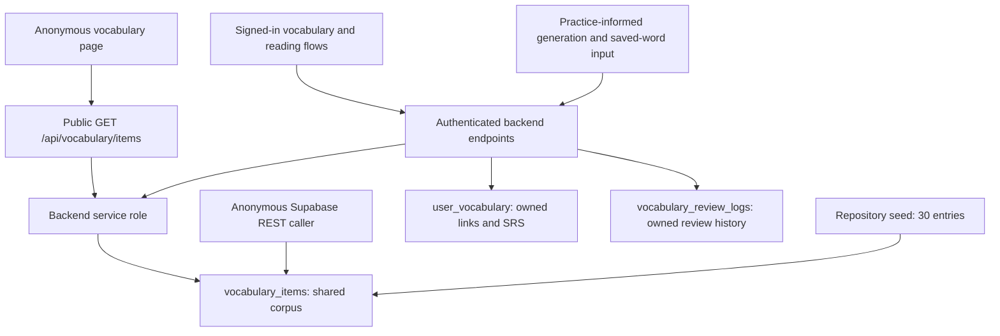

# Round I — Vocabulary items anonymous access truth

Date: 2026-09-05. Audited code: `e217cd7e1ae6426422eb6c7975498f90b91fb615`.

**Preferred option: OPTION D — MOVE BEHIND BACKEND. Investigation only; no enforcement change implemented.** The anonymous vocabulary bank is an existing product dependency, but direct anonymous table access is not. The frontend already uses the public backend. Both the raw REST surface and that backend currently expose more than the anonymous UI uses, without a public-row publication boundary.

This is evidence of unnecessary exposure, not proof of a security incident. The corpus combines seed content, generated content influenced by user practice, and user-submitted saved words. It cannot be classified wholesale as an intentionally public dictionary from the available evidence.

## 1. Preflight and scope

Command-derived initial state, from `/Users/yichengchiu/dev/Blabby/blabby`:

```text
HEAD: e217cd7e1ae6426422eb6c7975498f90b91fb615
origin/main: 88eada001f89597eb7721ea425c6fd4af23edde3
git rev-list --left-right --count origin/main...HEAD: 0 2
ahead/behind: 2/0
working tree: clean
e217cd7 docs: record production evidence closure blockers
d6ee879 docs: prepare production migration rollout
```

Both prior documentation commits remain ancestors. `origin/main` is the local tracking ref; this audit does not claim a fresh remote fetch or deployed-code parity. No reset, clean, stash manipulation, push, SQL-session retry, Render-access retry, or migration rollout action occurred.

The H/H-R document is preserved byte-for-byte: `docs/PRODUCTION_MIGRATION_ROLLOUT_READINESS_2026-09-05.md`, SHA-256 `b5e72fcc716a66f1f9e5e06b62bb0084f63d61764717e68afebcc23fc8163bee`. Billing, Task 1, and `practice_records_quality_grade_idx` are outside this change.

## 2. Table schema and column classification

Schema source: `supabase/migrations/20260507_vocabulary.sql:8–24`. All columns except `id`, `word`, and `zh_meaning` are nullable. `id` defaults to `gen_random_uuid()` and is the primary key; `created_at` defaults to `now()`. The primary key supplies an index. No other corpus index, unique constraint on `word`, or later corpus-schema alteration was found in the migration search.

The classifications below are the **proposed** anonymous contract, not current enforcement. Public fields require rows approved for publication. `PUBLIC_REQUIRED` means needed content via the API; **PUBLIC_REQUIRED for direct table transport = NONE**. `PUBLIC_OPTIONAL` fields already enrich visible cards and should initially be preserved to avoid a product regression. `AUTH_ONLY` means conservative exclusion from the anonymous response, not proof that the value is secret or currently rendered after login.

Backend shorthand: **shared projection** is `_vocab_item_select()` at `backend/main.py:5315`, explicitly selecting all 15 columns for the public list, owned-item joins, and generation lookup. Every column therefore has backend usage even where the UI ignores it.

| column | type | frontend used | backend used | sensitive | public-value / classification and reason |
|---|---|---|---|---|---|
| id | uuid | Card identity, save action, saved-state comparison | Shared projection; joins and existence checks | Identifier, not a credential | PUBLIC_REQUIRED — stable card/save reference |
| word | text NOT NULL | Cards, local search, review, speaking target | Shared projection; lookups, generated and saved-word inserts | Can be user supplied | PUBLIC_REQUIRED — core dictionary entry |
| part_of_speech | text | Bank/review label | Shared projection; seed/generation | Ordinary learning content | PUBLIC_OPTIONAL — useful label, card tolerates absence |
| zh_meaning | text NOT NULL | Translation, local search, review reveal | Shared projection; seed/generation; client-supplied save input | Learning answer; provenance matters | PUBLIC_REQUIRED — bilingual bank's core content |
| difficulty_level | text | No consumer found | Shared projection; active-use target shaping; seed/generation | Level metadata, no demonstrated secret | AUTH_ONLY — anonymous UI uses IELTS band instead |
| ielts_band_level | text | Band label and client filter | Shared projection; API level filter; active target; seed/generation | Ordinary learning classification | PUBLIC_REQUIRED — existing band navigation |
| topic | text | Topic label, filter, card/action metadata | Shared projection; API/topic pool; generation and speaking | Generated topic may derive from practice | PUBLIC_REQUIRED — existing navigation, only on approved rows |
| tags | text[] | No consumer found | Shared projection; generator includes caller's weakness tag | Internal generation/weakness metadata | INTERNAL_ONLY — unnecessary anonymous or card payload |
| simple_definition_en | text | No consumer found | Shared projection | Learning content, source not established | AUTH_ONLY — no demonstrated anonymous need |
| common_chunk | text | Bank, review, speaking suggestions | Shared projection; seed/generation; speaking enrichment | Learning content | PUBLIC_OPTIONAL — useful visible collocation |
| speaking_sentence | text | Full bank card, review; omitted in compact recommendation card | Shared projection; seed/generation | Learning content, potentially proprietary wording | PUBLIC_OPTIONAL — useful example after publication review |
| common_mistake | text | No consumer found | Shared projection | Learning content, no demonstrated secret | AUTH_ONLY — no demonstrated anonymous need |
| better_than | text[] | Bank/recommendation comparison | Shared projection | Learning content | PUBLIC_OPTIONAL — existing conditional card enrichment |
| usage_note_zh | text | Bank/recommendation, review | Shared projection; seed/generation | Learning content, provenance matters | PUBLIC_OPTIONAL — existing explanation |
| created_at | timestamptz | No corpus timestamp consumer found | Shared projection; database default | Internal ingestion timeline | INTERNAL_ONLY — no anonymous product value |

All 15 columns classified: 5 required, 5 optional, 3 authenticated, 2 internal. `UNKNOWN` columns: NONE. **Row provenance/publication eligibility remains UNKNOWN for the production corpus.**

Identity/content fields are `id`, `word`, `part_of_speech`, `zh_meaning`, and `simple_definition_en`; learning fields are the levels, topic, collocation, sentence, mistake, comparison, and usage note; internal fields are tags/timestamp. There is no `lemma`, corpus `source`, generation ID, quality flag, review state, password, token, or user-ID column. Dedicated secrets/protected exam-answer fields: **NONE found**. Answer-like learning content does exist: translations and examples are revealed in flashcards. Absence of dedicated secret columns does not establish safety of all free-form values.

## 3. Sources, ownership, and provenance

- `supabase/seed_vocabulary.sql` contains 30 entries, three each in 10 topics, inserting nine content fields. The vocabulary migration and seed originate in commit `b33f821` (`feat(vocab): DB migration + seed + backend API`). Seed count is not production row count or proof of the current contents of those rows.
- Authenticated `POST /api/vocabulary/generate` (`backend/main.py:5832–6045`, 3/minute) reads the caller's recent practice topics/weaknesses, queries up to 10 corpus entries for the mapped topic, and may insert generated entries into the **shared** corpus. `tags` explicitly receives the weakness tag. Generation has no public-review/provenance gate.
- Authenticated `POST /api/vocabulary/save_word` (`backend/main.py:8828–8947`, 30/minute) normalizes a word to letters/hyphens/apostrophes, at most 60 characters, and accepts optional client-supplied `zh_meaning` truncated to 30 characters. If the word is absent, it creates a shared corpus row, then saves a user-owned link. Existing corpus meanings are not overwritten by this path. Sparse shared rows are therefore an expected possible source shape.
- Speaking enrichment reads the corpus; it does not create entries in the examined enrichment block. No additional tracked corpus import source or content-license/publication record was identified by the repository audit. This is an evidence gap, not a conclusion that no rights exist.

`user_vocabulary` is a separate per-user collection: `user_id`, `vocabulary_item_id`, SRS state/counters, review timestamps, `source`, `source_practice_record_id`, and its own `created_at`. It has a unique `(user_id, vocabulary_item_id)` constraint and own-user RLS. `vocabulary_review_logs` records owned review activity. These user-table fields must not be mistaken for columns exposed by the corpus probe. The audit did not read production user collections or review logs.

## 4. Dependency graph



The raw REST branch has no current frontend dependency and bypasses the application limiter. Closing only that branch would still leave the public backend's current broad projection and unrestricted row selection.

## 5. ANON_DEPENDENCY_MATRIX

Search covered table names, `_vocab_item_select`, API paths, fetch/auth wrappers, `.from(`/`.table(` and REST paths across frontend/backend, and field-level consumers. The frontend Supabase client in `vocabulary.html:927` is used for auth/session handling. No direct frontend Supabase corpus query was found; `.from(` matches in frontend included `Array.from`, not table reads.

| surface | anon accessible | direct Supabase | columns | required for product | revoke impact |
|---|---|---|---|---|---|
| vocabulary.html bank | Yes, boot fetch has no Authorization | No, public backend API | Receives 15; renders/uses the 10 PUBLIC_REQUIRED/PUBLIC_OPTIONAL fields | Yes, existing anonymous bank | Revoking only raw anon SELECT does not break this path if backend service-role access is preserved |
| Vocabulary recommendations | Yes, same public API | No | Receives 15; shared compact card omits sentence rendering | Yes, current anonymous recommendation cards | Same as bank |
| Search / topic / band filters | Yes, client filters `allItems` | No | word, zh_meaning, topic, ielts_band_level plus displayed card fields | Yes | Same as bank; introducing a backend limit without UI changes would truncate search |
| Homepage / landing | Navigation to vocabulary page | No | No corpus read on landing itself | Link destination depends on public API | No direct impact |
| Signup / login | Auth flow accessible | No corpus read | None | No corpus dependency | None identified |
| Anonymous speaking trial | Yes | No | Corpus suggestion enrichment is skipped when `is_anonymous` | No corpus dependency in examined trial path | None identified |
| Signed-in speaking / active vocabulary | Requires session for personalized flow | No, backend | Suggestion id/word/translation/chunk/topic; owned active-target joins also use levels | Authenticated learning dependency | Preserve backend service-role and ownership behavior |
| Writing | No identified corpus query in writing flow | No | None from this corpus | No identified dependency | None identified |
| Reading dictionary / save | Lookup, translation, and save require auth | No, backend | Separate LLM definition/translation; saved word/meaning and IDs | Authenticated dictionary/save dependency | Raw anon revoke does not affect backend; existing save quota gap below |
| History | No identified corpus endpoint/direct query in history UI | No | No direct corpus projection | No identified direct dependency | None identified |
| My vocabulary / journal / flashcards | Auth required for owned data | No, backend | Owned fields plus explicit 15-column corpus join; review renders word/POS/meaning/chunk/sentence/usage | Yes, authenticated | Preserve joins and service-role access |
| Hub review count / admin explanatory text | Hub review API is authenticated; admin has descriptive corpus text | No | Hub owned review response; admin text is not a corpus query | Hub authenticated review dependency | No raw anon dependency |

`loadBank` (`vocabulary.html:1029`) fetches the whole API response. `renderBank` (:1074) searches word/Chinese meaning and filters topic/band locally; there is no pagination. `loadRecommended` (:1095) makes another unbounded list request, then filters saved IDs and selects six locally. Boot (:1635) starts these without a login gate. Save uses `authJson` (:978) and requires a token. This API is the primary transport, not a dormant fallback; no separate direct-table fallback was found. The bank currently requires network/backend availability, with an error state rather than an offline corpus fallback.

## 6. Backend access and quota contract

The backend's `supabase_admin` is the service-role client. Public list (`main.py:5511`) uses explicit **all 15** columns, optional exact `topic`, exact `ielts_band_level` via `level`, and substring `word` via `search`, ordered by word. It has no explicit `.limit`, `.range`, public-row allowlist, or response reduction beyond that projection. A provider row cap may exist; it was not verified. Changing the shared projection helper globally would also change authenticated joins/generation responses.

Authenticated corpus consumers include owned saved/review joins (:5576, :5671, :5694), active-use target shaping (:5452), topic generation lookup (:5929), and speaking enrichment (:3126–3178). Speaking exact/fuzzy lookups use limit 1; its topic pool feeds up to three suggestions. `_tag_vocab_weakness` (:8015) only performs its owned vocabulary/corpus lookups for Pro users. Reading `/vocab/lookup` (:8660) and `/vocab/translate_zh` (:8775) use cached LLM dictionary operations, not corpus reads. No generation, translation, save, or review POST was invoked against production in this audit.

`POST /api/vocabulary/my` saves a reference in `user_vocabulary`; it does not create corpus content. It authenticates, returns an existing owned link before quota checking, counts owned saved rows for Free users, and rejects a new item at 30 with **403, `detail.error = "vocab_limit_reached"`**. It then checks corpus ID existence before insertion. This is distinct from public corpus browsing.

**Existing quota gap, not changed in Round I:** `/api/vocabulary/save_word` has no corresponding 30-word quota check. A hermetic local request with 30 existing saved rows added a 31st through this alternate authenticated route. `/my` passed the expected rejection/idempotency checks. Thus the `/my` contract is verified locally, but a global claim that every save route enforces the Free limit would be false. This is a source/local-test finding, not a production write or verification of deployed behavior. No billing or quota implementation was modified.

## 7. Repo access contract

**REPO CONTRACT ONLY — NOT CURRENT PRODUCTION VERIFIED** applies to policy/catalog/ACL statements in this section. Current REST behavior is separately recorded below.

| operation / role | repository contract |
|---|---|
| RLS | Enabled on all three vocabulary tables; no FORCE RLS declaration found |
| anon SELECT | `Anyone can read vocabulary_items`: `FOR SELECT USING (true)`, no explicit TO; includes PUBLIC roles, conditional on table privileges |
| authenticated SELECT | Same policy, not a separate authenticated-only policy; privileges remain a separate requirement |
| anon/authenticated INSERT, UPDATE, DELETE on corpus | No applicable write policy declared in the vocabulary migration; ordinary non-bypass roles with RLS cannot write through these policies |
| corpus GRANTs | Vocabulary migration has no explicit table GRANT. Baseline grant loop (`00000000_baseline_from_production.sql:263–274`) names other tables, not vocabulary tables |
| service_role | Backend intentionally uses service role. Local replay shim explicitly sets BYPASSRLS and default table privileges for this role; production role attributes/current ACL were not inspected |
| owned tables | `FOR ALL` policies enforce `auth.uid() = user_id` with USING and WITH CHECK; backend also explicitly filters ownership because its client is privileged |

Policy applicability does not itself grant table privileges. PostgreSQL documents both [row security policies](https://www.postgresql.org/docs/17/ddl-rowsecurity.html) and the separate [privilege system](https://www.postgresql.org/docs/17/ddl-priv.html). The local shim (`supabase/replay/00_local_shim.sql:37–38,60–61`) deliberately does not default-grant corpus SELECT to anon/authenticated. A clean replay's permission denial could therefore be missing grants, not evidence of a working row policy or production lockdown. This audit neither replayed nor repaired that ACL gap.

## 8. Minimal production read evidence

Anonymous REST GET only, using the existing public frontend anon key and configured project `mkwywkwruyqzdhuzwnoa`. No user session, service-role key, SQL session, or credentials in output. Three row results were read in total; no row values, literal IDs, or corpus dump were saved into this document/repository. Temporary evidence retains request structure, response shape, counts, and non-null booleans only.

| probe | request shape | result |
|---|---|---|
| Explicit columns/count | `/rest/v1/vocabulary_items?select=<all 15 names>&order=id.asc&limit=1`, `Prefer: count=exact` | 2026-09-05 03:39:33.734986 UTC: HTTP 206, Content-Range `0-0/83`, one row with all 15 keys |
| Offset/order/star | `select=*&order=created_at.desc,id.asc&offset=1&limit=1` | 03:39:33.884227 UTC: HTTP 200, Content-Range `1-1/*`, one row, same 15 keys |
| Filter/internal fields | `select=id,tags,created_at&id=eq.<previously-read-id>&limit=1` | HTTP 200, one row, both tags and created_at non-null |
| Public backend authentication check | Unauthenticated GET `https://blabby-backend.onrender.com/api/vocabulary/items?search=roundiauditnomatch7a23159b4c1f46f1` | HTTP 200, `{"items":[]}`; zero corpus rows downloaded |

**83 is the anon-visible count at probe time**, not a SQL-verified physical table total or a historical seed reconciliation. REST success verifies observable access, not the policy name, complete grants, role attributes, deployment SHA, or the production migration ledger. The backend empty-filter probe proves unauthenticated availability; its 15-column projection is code-derived, not verified from a nonempty production backend response.

## 9. Enumeration and content risk

- Count, all-15-column selection, wildcard selection, offset pagination, two caller-selected orderings, and equality filtering were demonstrated. This supports an enumerable anonymous surface; exhaustive extraction was intentionally not attempted. It does not prove unlimited single-response size, every possible ordering/filter, or absence of upstream caps.
- Non-null internal tags/timestamps are exposed. The code ties generated tags to weaknesses; probes did not attempt attribution or establish that any observed value identifies a user. No PII incident or credential leak is asserted.
- Public backend list is declared `30/minute` with IP-based `get_remote_address` (`main.py:329,5512`); no explicit distributed limiter storage is configured in the examined initialization. Multi-instance effectiveness and upstream rate limits were not verified. Direct REST does not traverse that limiter; sampled responses contained no rate-limit headers, which is not proof that the provider has no limits. No load/rate-limit stress test occurred.
- API authentication is absent by design for browsing. Authenticated saves/reviews are separately gated. Turning only database SELECT into auth-only would not close the backend's service-role public response.
- Curated translations, examples, and generated content may have product value and publication/licensing constraints. No full-corpus rights inventory was available. Public learning content can always be copied once served; rate limiting/pagination offers bounded access and operational control, not an anti-copy guarantee.

## 10. Options and decision

| option | assessment |
|---|---|
| A — KEEP CURRENT ANON READ | Reject: internal fields and mixed provenance prevent the intentional-public-corpus premise; direct access is unnecessary |
| B — NARROW ANON COLUMNS | Reject as preferred: no frontend direct-read dependency; leaves a raw corpus transport and does not solve public-row eligibility |
| C — AUTHENTICATED ONLY | Reject: an API login wall would break the existing anonymous bank; a database-only auth wall leaves the public API exposure |
| D — MOVE BEHIND BACKEND | **Preferred**: consolidate the existing API boundary, constrain public fields/rows and query cost, then close raw anon access while preserving privileged backend and owned flows |
| E — HYBRID | Not selected as a separate architecture: authenticated rich flows already exist; no new dual public transport is needed for this scope |

Proposed public API projection: `id,word,part_of_speech,zh_meaning,ielts_band_level,topic,common_chunk,speaking_sentence,better_than,usage_note_zh`. This preserves all currently used anonymous card fields and removes five unused fields. Publication eligibility must be enforced **as well as** column shaping; filtering only tags/timestamps still publishes user-created/generated text. A narrow explicit approved corpus is a possible starting input, but the seed's presence alone is not publication-rights approval and no IDs were invented or authorized here.

Security: reduce raw/table-wide access and internal metadata responses, bound query sizes, validate filters and ensure rate controls cover the serving path. Keep RLS changes small after actual grants/role dependencies are known. Service role remains privileged, so endpoints must enforce public-row scope and user ownership explicitly. Anonymous browsing need not depend on user auth. Pagination alone cannot prevent enumeration of the intended public subset.

Product: retain anonymous bank and recommendation cards without signup friction. API indirection already exists, so no extra hop is introduced by choosing D. Bounded queries require coherent bank search/filter/pagination behavior and recommendation selection; merely truncating the current response would silently break local filtering. No static/offline corpus fallback exists today; this decision does not add one. Latency changes depend on the eventual bounded-query/cache implementation and were not benchmarked.

Engineering: reuse the current endpoint, separate its public projection from shared authenticated helpers, define an explicit publication boundary, add bounded retrieval with matching frontend behavior, and only then prepare narrowly scoped raw-access restrictions after catalog evidence is available. Preserve authenticated/service-role operations and owned quota semantics. No `main.py` refactor or new vocabulary feature is needed. Tests must cover response shaping, actual database privileges, ownership, paging/search, and negative mutations of the proposed enforcement.

Business: the bank is a useful pre-signup experience; a blanket login wall has no demonstrated necessity. Corpus compilation/examples may deserve protection, while the acquisition value of a reviewed public subset may justify copying risk. Neither valuation nor conversion impact was measured. Choose D to retain the experience while making publication intentional.

## 11. Implementation status

**DOCS ONLY.** No code, test-suite, migration, policy, grant, index, or frontend change. No pending migration was created. Evidence is sufficient to choose D, but not to implement the complete enforcement safely as a tiny edit: public-row eligibility is missing, production ACL/catalog access remains unavailable, and frontend filtering depends on the current list shape. A one-line limit, shared-helper edit, or raw-SELECT revoke alone would leave exposure or break behavior.

This decision is an investigation result, not a claim that OPTION D is implemented or production exposure remediated. No request to authorize production action is made in this round.

## 12. Tests and validation

Python 3.11 focused suite with Node 20 available:

```text
backend/tests/test_frontend_vocabulary_paywall_contracts.py
backend/tests/test_active_vocabulary.py
backend/tests/test_reading_pool_vocab_weak.py
backend/tests/test_reading_vocab_extraction.py
/tmp/blabby-round-i-evidence/test_observed_contracts.py
32 passed, 6 warnings in 4.84s
```

The temporary four-case observation harness imports the current backend with provider/DB credentials disabled, overrides auth/Pro status, and supplies an in-memory query client. It verifies `/my` 30→31 rejection with exact error and no insert, 29→30 success, existing-item re-add at 30 with no insert, and the **existing undesired** `/save_word` 30→31 success. That last passing observation is evidence of a defect, not an endorsed quota contract. It is deliberately not added as a permissive regression test. The harness uses no production client or startup network operation. The warnings comprise dependency/FastAPI deprecations and a temporary pytest-root cache permission warning; no test failed.

Node 20 direct harness results:

```text
backend/tests/frontend_vocabulary_paywall_behavior.mjs
vocabulary paywall API classification: PASS
backend/tests/frontend_active_vocabulary_behavior.mjs
Active vocabulary behavior: all assertions passed.
```

These are local behavior checks, not browser/deployed-schema certification. No new security contract was implemented; accordingly no policy/config mutation-red test is claimed. Before a future D implementation can pass, disposable-DB tests must demonstrate raw anon denial (including internal columns), preserved authenticated/backend access, and red failures when permissions are broadened or service-role access is removed. API tests must likewise turn red if internal fields/unapproved rows return, and frontend tests must cover bank/recommendation/search and the unchanged 31st-word/idempotency contract. Existing alternate-save quota debt must be handled explicitly rather than hidden by `/my`-only coverage.

Documentation validation: `git diff --check`; exact-path staging only; verify the commit contains only this new document and that the protected H/H-R document hash remains unchanged. No full release gate was represented as necessary or completed for this documentation-only change.

## 13. Production safety and remaining blockers

```text
PRODUCTION DB WRITE: 0
PRODUCTION POLICY CHANGE: 0
PRODUCTION MIGRATION APPLY: 0
GIT PUSH: NO
LOCAL MIGRATION: NONE
```

Production rollout stays **BLOCKED / NOT AUTHORIZED**: SQL access, Render deployed SHA, and backup evidence remain unresolved; production migration allowlist remains NONE. This audit did not retry those access paths. Additional implementation prerequisites are public-row provenance/rights criteria and a coherent bounded API/frontend contract. The existing alternate-save quota gap remains recorded and unfixed.

**ROUND I audit verdict: PASS — OPTION D preferred; investigation documented, production unchanged.** This is not a production-security or migration-readiness PASS. Round J has not started.
