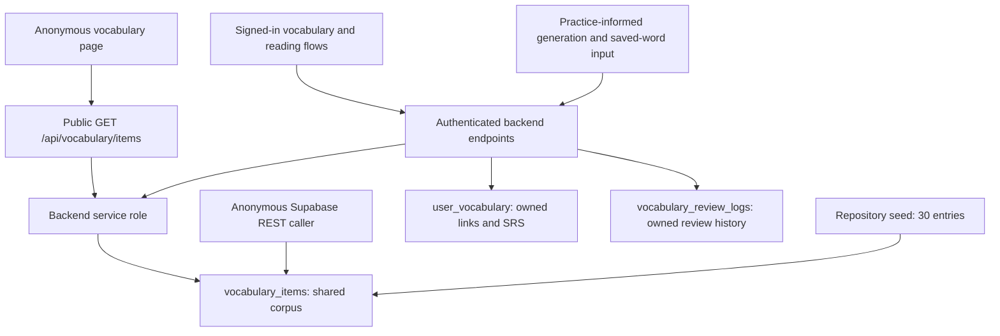

# Round I — Vocabulary items anonymous access truth

Date: 2026-09-05. Audited code: `e217cd7e1ae6426422eb6c7975498f90b91fb615`.

**Preferred option: OPTION D — MOVE BEHIND BACKEND. Investigation only; no enforcement change implemented.** The anonymous vocabulary bank is an existing product dependency, but direct anonymous table access is not. The frontend already uses the public backend. Both the raw REST surface and that backend currently expose more than the anonymous UI uses, without a public-row publication boundary.

This is evidence of unnecessary exposure, not proof of a security incident. The corpus combines seed content, generated content influenced by user practice, and user-submitted saved words. It cannot be classified wholesale as an intentionally public dictionary from the available evidence.

## 1. Preflight and scope

Command-derived initial state, from `/Users/yichengchiu/dev/Blabby/blabby`:

```text
HEAD: e217cd7e1ae6426422eb6c7975498f90b91fb615
origin/main: 88eada001f89597eb7721ea425c6fd4af23edde3
git rev-list --left-right --count origin/main...HEAD: 0 2
ahead/behind: 2/0
working tree: clean
e217cd7 docs: record production evidence closure blockers
d6ee879 docs: prepare production migration rollout
```

Both prior documentation commits remain ancestors. `origin/main` is the local tracking ref; this audit does not claim a fresh remote fetch or deployed-code parity. No reset, clean, stash manipulation, push, SQL-session retry, Render-access retry, or migration rollout action occurred.

The H/H-R document is preserved byte-for-byte: `docs/PRODUCTION_MIGRATION_ROLLOUT_READINESS_2026-09-05.md`, SHA-256 `b5e72fcc716a66f1f9e5e06b62bb0084f63d61764717e68afebcc23fc8163bee`. Billing, Task 1, and `practice_records_quality_grade_idx` are outside this change.

## 2. Table schema and column classification

Schema source: `supabase/migrations/20260507_vocabulary.sql:8–24`. All columns except `id`, `word`, and `zh_meaning` are nullable. `id` defaults to `gen_random_uuid()` and is the primary key; `created_at` defaults to `now()`. The primary key supplies an index. No other corpus index, unique constraint on `word`, or later corpus-schema alteration was found in the migration search.

The classifications below are the **proposed** anonymous contract, not current enforcement. Public fields require rows approved for publication. `PUBLIC_REQUIRED` means needed content via the API; **PUBLIC_REQUIRED for direct table transport = NONE**. `PUBLIC_OPTIONAL` fields already enrich visible cards and should initially be preserved to avoid a product regression. `AUTH_ONLY` means conservative exclusion from the anonymous response, not proof that the value is secret or currently rendered after login.

Backend shorthand: **shared projection** is `_vocab_item_select()` at `backend/main.py:5315`, explicitly selecting all 15 columns for the public list, owned-item joins, and generation lookup. Every column therefore has backend usage even where the UI ignores it.

| column | type | frontend used | backend used | sensitive | public-value / classification and reason |
|---|---|---|---|---|---|
| id | uuid | Card identity, save action, saved-state comparison | Shared projection; joins and existence checks | Identifier, not a credential | PUBLIC_REQUIRED — stable card/save reference |
| word | text NOT NULL | Cards, local search, review, speaking target | Shared projection; lookups, generated and saved-word inserts | Can be user supplied | PUBLIC_REQUIRED — core dictionary entry |
| part_of_speech | text | Bank/review label | Shared projection; seed/generation | Ordinary learning content | PUBLIC_OPTIONAL — useful label, card tolerates absence |
| zh_meaning | text NOT NULL | Translation, local search, review reveal | Shared projection; seed/generation; client-supplied save input | Learning answer; provenance matters | PUBLIC_REQUIRED — bilingual bank's core content |
| difficulty_level | text | No consumer found | Shared projection; active-use target shaping; seed/generation | Level metadata, no demonstrated secret | AUTH_ONLY — anonymous UI uses IELTS band instead |
| ielts_band_level | text | Band label and client filter | Shared projection; API level filter; active target; seed/generation | Ordinary learning classification | PUBLIC_REQUIRED — existing band navigation |
| topic | text | Topic label, filter, card/action metadata | Shared projection; API/topic pool; generation and speaking | Generated topic may derive from practice | PUBLIC_REQUIRED — existing navigation, only on approved rows |
| tags | text[] | No consumer found | Shared projection; generator includes caller's weakness tag | Internal generation/weakness metadata | INTERNAL_ONLY — unnecessary anonymous or card payload |
| simple_definition_en | text | No consumer found | Shared projection | Learning content, source not established | AUTH_ONLY — no demonstrated anonymous need |
| common_chunk | text | Bank, review, speaking suggestions | Shared projection; seed/generation; speaking enrichment | Learning content | PUBLIC_OPTIONAL — useful visible collocation |
| speaking_sentence | text | Full bank card, review; omitted in compact recommendation card | Shared projection; seed/generation | Learning content, potentially proprietary wording | PUBLIC_OPTIONAL — useful example after publication review |
| common_mistake | text | No consumer found | Shared projection | Learning content, no demonstrated secret | AUTH_ONLY — no demonstrated anonymous need |
| better_than | text[] | Bank/recommendation comparison | Shared projection | Learning content | PUBLIC_OPTIONAL — existing conditional card enrichment |
| usage_note_zh | text | Bank/recommendation, review | Shared projection; seed/generation | Learning content, provenance matters | PUBLIC_OPTIONAL — existing explanation |
| created_at | timestamptz | No corpus timestamp consumer found | Shared projection; database default | Internal ingestion timeline | INTERNAL_ONLY — no anonymous product value |

All 15 columns classified: 5 required, 5 optional, 3 authenticated, 2 internal. `UNKNOWN` columns: NONE. **Row provenance/publication eligibility remains UNKNOWN for the production corpus.**

Identity/content fields are `id`, `word`, `part_of_speech`, `zh_meaning`, and `simple_definition_en`; learning fields are the levels, topic, collocation, sentence, mistake, comparison, and usage note; internal fields are tags/timestamp. There is no `lemma`, corpus `source`, generation ID, quality flag, review state, password, token, or user-ID column. Dedicated secrets/protected exam-answer fields: **NONE found**. Answer-like learning content does exist: translations and examples are revealed in flashcards. Absence of dedicated secret columns does not establish safety of all free-form values.

## 3. Sources, ownership, and provenance

- `supabase/seed_vocabulary.sql` contains 30 entries, three each in 10 topics, inserting nine content fields. The vocabulary migration and seed originate in commit `b33f821` (`feat(vocab): DB migration + seed + backend API`). Seed count is not production row count or proof of the current contents of those rows.
- Authenticated `POST /api/vocabulary/generate` (`backend/main.py:5832–6045`, 3/minute) reads the caller's recent practice topics/weaknesses, queries up to 10 corpus entries for the mapped topic, and may insert generated entries into the **shared** corpus. `tags` explicitly receives the weakness tag. Generation has no public-review/provenance gate.
- Authenticated `POST /api/vocabulary/save_word` (`backend/main.py:8828–8947`, 30/minute) normalizes a word to letters/hyphens/apostrophes, at most 60 characters, and accepts optional client-supplied `zh_meaning` truncated to 30 characters. If the word is absent, it creates a shared corpus row, then saves a user-owned link. Existing corpus meanings are not overwritten by this path. Sparse shared rows are therefore an expected possible source shape.
- Speaking enrichment reads the corpus; it does not create entries in the examined enrichment block. No additional tracked corpus import source or content-license/publication record was identified by the repository audit. This is an evidence gap, not a conclusion that no rights exist.

`user_vocabulary` is a separate per-user collection: `user_id`, `vocabulary_item_id`, SRS state/counters, review timestamps, `source`, `source_practice_record_id`, and its own `created_at`. It has a unique `(user_id, vocabulary_item_id)` constraint and own-user RLS. `vocabulary_review_logs` records owned review activity. These user-table fields must not be mistaken for columns exposed by the corpus probe. The audit did not read production user collections or review logs.

## 4. Dependency graph



The raw REST branch has no current frontend dependency and bypasses the application limiter. Closing only that branch would still leave the public backend's current broad projection and unrestricted row selection.

## 5. ANON_DEPENDENCY_MATRIX

Search covered table names, `_vocab_item_select`, API paths, fetch/auth wrappers, `.from(`/`.table(` and REST paths across frontend/backend, and field-level consumers. The frontend Supabase client in `vocabulary.html:927` is used for auth/session handling. No direct frontend Supabase corpus query was found; `.from(` matches in frontend included `Array.from`, not table reads.

| surface | anon accessible | direct Supabase | columns | required for product | revoke impact |
|---|---|---|---|---|---|
| vocabulary.html bank | Yes, boot fetch has no Authorization | No, public backend API | Receives 15; renders/uses the 10 PUBLIC_REQUIRED/PUBLIC_OPTIONAL fields | Yes, existing anonymous bank | Revoking only raw anon SELECT does not break this path if backend service-role access is preserved |
| Vocabulary recommendations | Yes, same public API | No | Receives 15; shared compact card omits sentence rendering | Yes, current anonymous recommendation cards | Same as bank |
| Search / topic / band filters | Yes, client filters `allItems` | No | word, zh_meaning, topic, ielts_band_level plus displayed card fields | Yes | Same as bank; introducing a backend limit without UI changes would truncate search |
| Homepage / landing | Navigation to vocabulary page | No | No corpus read on landing itself | Link destination depends on public API | No direct impact |
| Signup / login | Auth flow accessible | No corpus read | None | No corpus dependency | None identified |
| Anonymous speaking trial | Yes | No | Corpus suggestion enrichment is skipped when `is_anonymous` | No corpus dependency in examined trial path | None identified |
| Signed-in speaking / active vocabulary | Requires session for personalized flow | No, backend | Suggestion id/word/translation/chunk/topic; owned active-target joins also use levels | Authenticated learning dependency | Preserve backend service-role and ownership behavior |
| Writing | No identified corpus query in writing flow | No | None from this corpus | No identified dependency | None identified |
| Reading dictionary / save | Lookup, translation, and save require auth | No, backend | Separate LLM definition/translation; saved word/meaning and IDs | Authenticated dictionary/save dependency | Raw anon revoke does not affect backend; existing save quota gap below |
| History | No identified corpus endpoint/direct query in history UI | No | No direct corpus projection | No identified direct dependency | None identified |
| My vocabulary / journal / flashcards | Auth required for owned data | No, backend | Owned fields plus explicit 15-column corpus join; review renders word/POS/meaning/chunk/sentence/usage | Yes, authenticated | Preserve joins and service-role access |
| Hub review count / admin explanatory text | Hub review API is authenticated; admin has descriptive corpus text | No | Hub owned review response; admin text is not a corpus query | Hub authenticated review dependency | No raw anon dependency |

`loadBank` (`vocabulary.html:1029`) fetches the whole API response. `renderBank` (:1074) searches word/Chinese meaning and filters topic/band locally; there is no pagination. `loadRecommended` (:1095) makes another unbounded list request, then filters saved IDs and selects six locally. Boot (:1635) starts these without a login gate. Save uses `authJson` (:978) and requires a token. This API is the primary transport, not a dormant fallback; no separate direct-table fallback was found. The bank currently requires network/backend availability, with an error state rather than an offline corpus fallback.

## 6. Backend access and quota contract

The backend's `supabase_admin` is the service-role client. Public list (`main.py:5511`) uses explicit **all 15** columns, optional exact `topic`, exact `ielts_band_level` via `level`, and substring `word` via `search`, ordered by word. It has no explicit `.limit`, `.range`, public-row allowlist, or response reduction beyond that projection. A provider row cap may exist; it was not verified. Changing the shared projection helper globally would also change authenticated joins/generation responses.

Authenticated corpus consumers include owned saved/review joins (:5576, :5671, :5694), active-use target shaping (:5452), topic generation lookup (:5929), and speaking enrichment (:3126–3178). Speaking exact/fuzzy lookups use limit 1; its topic pool feeds up to three suggestions. `_tag_vocab_weakness` (:8015) only performs its owned vocabulary/corpus lookups for Pro users. Reading `/vocab/lookup` (:8660) and `/vocab/translate_zh` (:8775) use cached LLM dictionary operations, not corpus reads. No generation, translation, save, or review POST was invoked against production in this audit.

`POST /api/vocabulary/my` saves a reference in `user_vocabulary`; it does not create corpus content. It authenticates, returns an existing owned link before quota checking, counts owned saved rows for Free users, and rejects a new item at 30 with **403, `detail.error = "vocab_limit_reached"`**. It then checks corpus ID existence before insertion. This is distinct from public corpus browsing.

**Existing quota gap, not changed in Round I:** `/api/vocabulary/save_word` has no corresponding 30-word quota check. A hermetic local request with 30 existing saved rows added a 31st through this alternate authenticated route. `/my` passed the expected rejection/idempotency checks. Thus the `/my` contract is verified locally, but a global claim that every save route enforces the Free limit would be false. This is a source/local-test finding, not a production write or verification of deployed behavior. No billing or quota implementation was modified.

## 7. Repo access contract

**REPO CONTRACT ONLY — NOT CURRENT PRODUCTION VERIFIED** applies to policy/catalog/ACL statements in this section. Current REST behavior is separately recorded below.

| operation / role | repository contract |
|---|---|
| RLS | Enabled on all three vocabulary tables; no FORCE RLS declaration found |
| anon SELECT | `Anyone can read vocabulary_items`: `FOR SELECT USING (true)`, no explicit TO; includes PUBLIC roles, conditional on table privileges |
| authenticated SELECT | Same policy, not a separate authenticated-only policy; privileges remain a separate requirement |
| anon/authenticated INSERT, UPDATE, DELETE on corpus | No applicable write policy declared in the vocabulary migration; ordinary non-bypass roles with RLS cannot write through these policies |
| corpus GRANTs | Vocabulary migration has no explicit table GRANT. Baseline grant loop (`00000000_baseline_from_production.sql:263–274`) names other tables, not vocabulary tables |
| service_role | Backend intentionally uses service role. Local replay shim explicitly sets BYPASSRLS and default table privileges for this role; production role attributes/current ACL were not inspected |
| owned tables | `FOR ALL` policies enforce `auth.uid() = user_id` with USING and WITH CHECK; backend also explicitly filters ownership because its client is privileged |

Policy applicability does not itself grant table privileges. PostgreSQL documents both [row security policies](https://www.postgresql.org/docs/17/ddl-rowsecurity.html) and the separate [privilege system](https://www.postgresql.org/docs/17/ddl-priv.html). The local shim (`supabase/replay/00_local_shim.sql:37–38,60–61`) deliberately does not default-grant corpus SELECT to anon/authenticated. A clean replay's permission denial could therefore be missing grants, not evidence of a working row policy or production lockdown. This audit neither replayed nor repaired that ACL gap.

## 8. Minimal production read evidence

Anonymous REST GET only, using the existing public frontend anon key and configured project `mkwywkwruyqzdhuzwnoa`. No user session, service-role key, SQL session, or credentials in output. Three row results were read in total; no row values, literal IDs, or corpus dump were saved into this document/repository. Temporary evidence retains request structure, response shape, counts, and non-null booleans only.

| probe | request shape | result |
|---|---|---|
| Explicit columns/count | `/rest/v1/vocabulary_items?select=<all 15 names>&order=id.asc&limit=1`, `Prefer: count=exact` | 2026-09-05 03:39:33.734986 UTC: HTTP 206, Content-Range `0-0/83`, one row with all 15 keys |
| Offset/order/star | `select=*&order=created_at.desc,id.asc&offset=1&limit=1` | 03:39:33.884227 UTC: HTTP 200, Content-Range `1-1/*`, one row, same 15 keys |
| Filter/internal fields | `select=id,tags,created_at&id=eq.<previously-read-id>&limit=1` | HTTP 200, one row, both tags and created_at non-null |
| Public backend authentication check | Unauthenticated GET `https://blabby-backend.onrender.com/api/vocabulary/items?search=roundiauditnomatch7a23159b4c1f46f1` | HTTP 200, `{"items":[]}`; zero corpus rows downloaded |

**83 is the anon-visible count at probe time**, not a SQL-verified physical table total or a historical seed reconciliation. REST success verifies observable access, not the policy name, complete grants, role attributes, deployment SHA, or the production migration ledger. The backend empty-filter probe proves unauthenticated availability; its 15-column projection is code-derived, not verified from a nonempty production backend response.

## 9. Enumeration and content risk

- Count, all-15-column selection, wildcard selection, offset pagination, two caller-selected orderings, and equality filtering were demonstrated. This supports an enumerable anonymous surface; exhaustive extraction was intentionally not attempted. It does not prove unlimited single-response size, every possible ordering/filter, or absence of upstream caps.
- Non-null internal tags/timestamps are exposed. The code ties generated tags to weaknesses; probes did not attempt attribution or establish that any observed value identifies a user. No PII incident or credential leak is asserted.
- Public backend list is declared `30/minute` with IP-based `get_remote_address` (`main.py:329,5512`); no explicit distributed limiter storage is configured in the examined initialization. Multi-instance effectiveness and upstream rate limits were not verified. Direct REST does not traverse that limiter; sampled responses contained no rate-limit headers, which is not proof that the provider has no limits. No load/rate-limit stress test occurred.
- API authentication is absent by design for browsing. Authenticated saves/reviews are separately gated. Turning only database SELECT into auth-only would not close the backend's service-role public response.
- Curated translations, examples, and generated content may have product value and publication/licensing constraints. No full-corpus rights inventory was available. Public learning content can always be copied once served; rate limiting/pagination offers bounded access and operational control, not an anti-copy guarantee.

## 10. Options and decision

| option | assessment |
|---|---|
| A — KEEP CURRENT ANON READ | Reject: internal fields and mixed provenance prevent the intentional-public-corpus premise; direct access is unnecessary |
| B — NARROW ANON COLUMNS | Reject as preferred: no frontend direct-read dependency; leaves a raw corpus transport and does not solve public-row eligibility |
| C — AUTHENTICATED ONLY | Reject: an API login wall would break the existing anonymous bank; a database-only auth wall leaves the public API exposure |
| D — MOVE BEHIND BACKEND | **Preferred**: consolidate the existing API boundary, constrain public fields/rows and query cost, then close raw anon access while preserving privileged backend and owned flows |
| E — HYBRID | Not selected as a separate architecture: authenticated rich flows already exist; no new dual public transport is needed for this scope |

Proposed public API projection: `id,word,part_of_speech,zh_meaning,ielts_band_level,topic,common_chunk,speaking_sentence,better_than,usage_note_zh`. This preserves all currently used anonymous card fields and removes five unused fields. Publication eligibility must be enforced **as well as** column shaping; filtering only tags/timestamps still publishes user-created/generated text. A narrow explicit approved corpus is a possible starting input, but the seed's presence alone is not publication-rights approval and no IDs were invented or authorized here.

Security: reduce raw/table-wide access and internal metadata responses, bound query sizes, validate filters and ensure rate controls cover the serving path. Keep RLS changes small after actual grants/role dependencies are known. Service role remains privileged, so endpoints must enforce public-row scope and user ownership explicitly. Anonymous browsing need not depend on user auth. Pagination alone cannot prevent enumeration of the intended public subset.

Product: retain anonymous bank and recommendation cards without signup friction. API indirection already exists, so no extra hop is introduced by choosing D. Bounded queries require coherent bank search/filter/pagination behavior and recommendation selection; merely truncating the current response would silently break local filtering. No static/offline corpus fallback exists today; this decision does not add one. Latency changes depend on the eventual bounded-query/cache implementation and were not benchmarked.

Engineering: reuse the current endpoint, separate its public projection from shared authenticated helpers, define an explicit publication boundary, add bounded retrieval with matching frontend behavior, and only then prepare narrowly scoped raw-access restrictions after catalog evidence is available. Preserve authenticated/service-role operations and owned quota semantics. No `main.py` refactor or new vocabulary feature is needed. Tests must cover response shaping, actual database privileges, ownership, paging/search, and negative mutations of the proposed enforcement.

Business: the bank is a useful pre-signup experience; a blanket login wall has no demonstrated necessity. Corpus compilation/examples may deserve protection, while the acquisition value of a reviewed public subset may justify copying risk. Neither valuation nor conversion impact was measured. Choose D to retain the experience while making publication intentional.

## 11. Implementation status

**DOCS ONLY.** No code, test-suite, migration, policy, grant, index, or frontend change. No pending migration was created. Evidence is sufficient to choose D, but not to implement the complete enforcement safely as a tiny edit: public-row eligibility is missing, production ACL/catalog access remains unavailable, and frontend filtering depends on the current list shape. A one-line limit, shared-helper edit, or raw-SELECT revoke alone would leave exposure or break behavior.

This decision is an investigation result, not a claim that OPTION D is implemented or production exposure remediated. No request to authorize production action is made in this round.

## 12. Tests and validation

Python 3.11 focused suite with Node 20 available:

```text
backend/tests/test_frontend_vocabulary_paywall_contracts.py
backend/tests/test_active_vocabulary.py
backend/tests/test_reading_pool_vocab_weak.py
backend/tests/test_reading_vocab_extraction.py
/tmp/blabby-round-i-evidence/test_observed_contracts.py
32 passed, 6 warnings in 4.84s
```

The temporary four-case observation harness imports the current backend with provider/DB credentials disabled, overrides auth/Pro status, and supplies an in-memory query client. It verifies `/my` 30→31 rejection with exact error and no insert, 29→30 success, existing-item re-add at 30 with no insert, and the **existing undesired** `/save_word` 30→31 success. That last passing observation is evidence of a defect, not an endorsed quota contract. It is deliberately not added as a permissive regression test. The harness uses no production client or startup network operation. The warnings comprise dependency/FastAPI deprecations and a temporary pytest-root cache permission warning; no test failed.

Node 20 direct harness results:

```text
backend/tests/frontend_vocabulary_paywall_behavior.mjs
vocabulary paywall API classification: PASS
backend/tests/frontend_active_vocabulary_behavior.mjs
Active vocabulary behavior: all assertions passed.
```

These are local behavior checks, not browser/deployed-schema certification. No new security contract was implemented; accordingly no policy/config mutation-red test is claimed. Before a future D implementation can pass, disposable-DB tests must demonstrate raw anon denial (including internal columns), preserved authenticated/backend access, and red failures when permissions are broadened or service-role access is removed. API tests must likewise turn red if internal fields/unapproved rows return, and frontend tests must cover bank/recommendation/search and the unchanged 31st-word/idempotency contract. Existing alternate-save quota debt must be handled explicitly rather than hidden by `/my`-only coverage.

Documentation validation: `git diff --check`; exact-path staging only; verify the commit contains only this new document and that the protected H/H-R document hash remains unchanged. No full release gate was represented as necessary or completed for this documentation-only change.

## 13. Production safety and remaining blockers

```text
PRODUCTION DB WRITE: 0
PRODUCTION POLICY CHANGE: 0
PRODUCTION MIGRATION APPLY: 0
GIT PUSH: NO
LOCAL MIGRATION: NONE
```

Production rollout stays **BLOCKED / NOT AUTHORIZED**: SQL access, Render deployed SHA, and backup evidence remain unresolved; production migration allowlist remains NONE. This audit did not retry those access paths. Additional implementation prerequisites are public-row provenance/rights criteria and a coherent bounded API/frontend contract. The existing alternate-save quota gap remains recorded and unfixed.

**ROUND I audit verdict: PASS — OPTION D preferred; investigation documented, production unchanged.** This is not a production-security or migration-readiness PASS. Round J has not started.

## Quota Bypass Closure — Round J

The preceding sections remain the historical Round I record. This addendum supersedes only the statement that the application save-path quota bypass is unfixed. OPTION D remains unimplemented; no anonymous corpus policy or API shaping changed.

### Preflight

Canonical working directory: `/Users/yichengchiu/dev/Blabby/blabby`.

```text
HEAD: fba7e39a3b927f9552bf52cdd2ba870ac74bde58
origin/main: 88eada001f89597eb7721ea425c6fd4af23edde3
git rev-list --left-right --count origin/main...HEAD: 0 3
ahead/behind: 3/0
working tree: clean
```

These are command-derived local Git facts, not deployment or remote-refresh claims. Existing commits and unrelated work were preserved. No production request was made in Round J.

### VOCABULARY_WRITE_PATH_MATRIX

Search covered repository routes, table references, insert/upsert/update/delete calls, SQL sources, frontend fetch/auth wrappers and direct Supabase calls, tests, README/CLAUDE notes, and internal/admin paths. Exactly two application insert sites create `user_vocabulary` entries. Historical notes were checked against current code; for example, the older CLAUDE description of no vocabulary paywall is stale.

| route/function | classification | auth | target table | quota before → after | idempotent | active caller |
|---|---|---|---|---|---|---|
| POST `/api/vocabulary/my` | CANONICAL | `verify_token` | `user_vocabulary` INSERT; corpus existence SELECT | Inline 30 gate → shared 30 gate; missing count now fails closed | Existing owned item returns before quota | Vocabulary bank/recommendation/generated-card save; Speaking suggestion button |
| POST `/api/vocabulary/save_word` | CANONICAL | `verify_token` | Optional `vocabulary_items` INSERT, then `user_vocabulary` INSERT | NONE → same shared 30 gate, before either insert | Existing owned item returns `status=exists` before quota | Reading click-to-save; route retained |
| POST `/api/vocabulary/review` | CANONICAL | `verify_token`, owned ID filter | `user_vocabulary` UPDATE; `vocabulary_review_logs` INSERT | N/A: changes review state, cannot add saved entries | Review events intentionally consume no new saved slot | Vocabulary flashcards |
| POST `/api/vocabulary/generate` | CANONICAL | `verify_token` | `vocabulary_items` INSERT only | N/A: shared content generation does not create owned saves | Topic/word reuse, not an owned-save operation | Vocabulary generation; later card save uses `/my` |
| Speaking enrichment, active-use target, Reading weakness tagging | CANONICAL | Existing session/Pro guards | SELECT only | N/A: not a save | N/A | Speaking/Reading personalized UI |
| `supabase/seed_vocabulary.sql` | INTERNAL_ONLY | Operator execution, not an HTTP route | `vocabulary_items` INSERT | N/A: corpus seed only | Not relied on for saved-item idempotency | Repository seed; not executed here |
| DELETE `/admin/user/{user_id}` | INTERNAL_ONLY | `verify_admin` | Auth-user deletion can cascade owned vocabulary/review rows under repo FKs | N/A: deletes, cannot increase saved count | Existing administrative behavior unchanged | Admin UI; not executed here |
| Other legacy save routes | No LEGACY_ACTIVE or LEGACY_DEAD route found | N/A | No additional insert/upsert path found | N/A | N/A | Bare `/save_word` is shorthand in notes, not a registered alternate route |
| Frontend direct Supabase vocabulary writes | No active caller found | Frontend Supabase use is auth/session | No frontend table write found | N/A | N/A | All three active save UIs use the two backend routes |
| External/custom authenticated REST writers | UNKNOWN | Production ACL/catalog unavailable | Potential direct owned-table write surface | Not verified; no DB quota constraint in repository vocabulary migration | Repo unique `(user_id, vocabulary_item_id)` only | No repository caller identified; not a claim that external writers are impossible |

The last row is an evidence boundary: application-route closure does not establish database-wide enforcement. No public-corpus, owned-table ACL, or policy migration was added to infer or alter this state.

### Root cause and minimal fix

`/my` contained the entire quota check inline. Reading's free-form `/api/vocabulary/save_word` implemented its own corpus resolution and owned insert without calling that check. This was an active path, not dead legacy code. Speaking also checked `body.error` although FastAPI sends the quota code under `body.detail.error`; Reading treated every failed save as a generic retry.

`backend/main.py` now defines **`FREE_VOCABULARY_LIMIT = 30`** and a small **`_check_vocabulary_save_allowed(user_id)`** helper. Both routes invoke it after checking for an existing owned link and before insertion. The helper reuses `get_user_pro_status`, backed by `is_user_pro` RPC; no Pro/payment logic was duplicated or changed. Free counts use exact count filtered by the verified `user_id`; the `limit(1)` only limits returned rows, not the requested count. A missing count now raises 503 instead of silently treating it as zero. Query exceptions propagate to the existing route-level 503 handling, with no insert.

Reading now checks quota before creating a missing corpus row as well as before creating the owned link. Existing translations, normalization, successful response shapes, and re-add behavior are preserved. No service layer, route removal, module refactor, or new vocabulary feature was introduced.

### Exact contract and authorization

Free limit remains 30 unique owned corpus links. Pro saves remain unlimited by this quota. A new save with count 29 succeeds; a new save with count at least 30 returns:

```json
{
  "detail": {
    "error": "vocab_limit_reached",
    "limit": 30,
    "message": "Free users may save up to 30 words. Upgrade to Pro for unlimited vocabulary."
  }
}
```

HTTP status is **403** on both routes. Existing owned-item re-add succeeds before either the Pro lookup or quota count, and consumes no slot. The contract is per `vocabulary_item_id`; this change does not deduplicate preexisting corpus entries by spelling or remove any historical over-limit rows.

Both routes derive ownership from the unchanged `verify_token`, which calls Supabase auth `get_user` for the Bearer token and requires a returned user ID. Client-supplied `user_id` is not owner truth. Behavioral tests exercise this verifier with a fake auth provider, including missing/malformed/expired credentials and another user's existing saved link. The shared helper also counts only the verified owner's rows. Pro-lookup failure retains the existing fail-safe Free behavior. No new authorization hole was found in these two routes.

### Race assessment

**Classification: REAL_QUOTA_RACE.** Count and insert remain separate PostgREST operations, without a database transaction spanning both. The repo unique constraint prevents duplicate links for the same owner/item; it does not cap distinct saved items.

A disposable in-memory concurrency observation used two independent HTTP client/event loops to model separate workers, held both counts at 29, then allowed a different new item through each route: **HTTP 200 + HTTP 200; final saved count 31**. This was a local model, not a production request. The save routes have synchronous DB operations after reading the body, reducing interleaving within one event loop, but that is not a cross-worker/instance guarantee. Production worker count, traffic/concurrency, and deployment topology were not retrieved, so the risk is not downgraded based on guessed product scale. Starting at 30, ordinary sequential new saves are rejected by both routes.

An atomic database operation that serializes each owner's count-and-insert would be required for a strict distributed bound, and would need to cover or deny direct writers too. No process-local lock is presented as a database solution. Per this round's bounded scope, the remaining race is explicitly recorded; no production apply, RPC implementation, or migration proposal was added. The HTTP route-bypass fix is not a claim of atomic/global enforcement.

### Frontend behavior

- `vocabulary.html`: existing nested-error classification, Pro paywall, and `/upgrade.html?source=vocab_limit` CTA unchanged.
- `index.html` Speaking suggestion: one-line correction reads `body.detail?.error`; existing 30-word upgrade nudge/CTA now executes for the canonical response.
- `reading.html`: quota 403 opens the existing modal with vocabulary-specific copy and the same `vocab_limit` CTA. The save button becomes usable again; failed quota requests do not mark words saved or emit `reading_word_saved`. Non-quota errors retain the generic failure path and are not misclassified as quota or an auth redirect.

No price, checkout code, payment funnel taxonomy, analytics event schema, or page design changed. Blabby Pro remains NT$199.

### Regression evidence and execution

The committed `backend/tests/test_vocabulary_save_quota.py` was created and executed **before backend changes**. Initial result: **7 failed, 21 passed**. Both variants of `test_save_word_cannot_bypass_free_vocabulary_limit` failed with `assert 200 == 403` (existing corpus entry and absent corpus entry). Canonical 31st rejection, both re-add paths, Pro, and auth baseline cases passed. Additional failures captured the alternate route's missing enforcement and the canonical missing-count-as-zero behavior.

After the fix: **28 passed**. Tests cover both save routes at 29/30, exact error JSON, re-add/no quota query, Pro above 30, missing/invalid auth, verified ownership despite a supplied foreign user ID, foreign rows excluded from count/idempotency, Pro/count failures, and no corpus insert on quota rejection. Auth/RPC/database dependencies are in-memory doubles; no live service is called.

The new `frontend_vocabulary_save_paths_behavior.mjs` executes actual Reading click and Speaking render/click handlers with a small DOM/fetch model. Before frontend changes, the two quota cases failed; six non-quota/success cases passed. After changes, all eight pass. It checks the modal/nudge CTA, no false saved state/telemetry, non-quota 401/403/503 handling, and successful/repeated-save behavior. The existing pytest harness runner now includes this file, so it runs in the established CI command. During harness development the Reading cache stub was corrected to the real `defnCache` name; the application quota failures were independently reproduced before their fix.

Focused run (Python 3.11, Node **v20.20.2**):

```text
tests/test_vocabulary_save_quota.py
tests/test_frontend_vocabulary_paywall_contracts.py
tests/test_active_vocabulary.py
tests/test_reading_pool_vocab_weak.py
tests/test_reading_vocab_extraction.py
tests/test_retention_focus.py
tests/test_progress_evidence.py
82 passed, 5 warnings in 1.76s
```

Direct Node 20 runs also passed the existing vocabulary paywall and active vocabulary harnesses. Full `pytest tests -q` from `backend/`: **671 passed, 10 skipped, 0 failed, 5 warnings in 47.37s**. The skipped tests are credential-gated integration tests; the warnings are existing dependency/FastAPI deprecations. Credential-gated test URLs/tokens were explicitly cleared, and provider keys set to test placeholders, to keep the full run local.

Validation also includes `git diff --check`, exact-path staging, and verification that the prior Round I document content is an unchanged prefix. The protected H/H-R document retains SHA-256 `b5e72fcc716a66f1f9e5e06b62bb0084f63d61764717e68afebcc23fc8163bee`.

### Production boundary

```text
PRODUCTION DB WRITE: 0
PRODUCTION POLICY CHANGE: 0
PRODUCTION MIGRATION APPLY: 0
PRODUCTION REQUESTS IN ROUND J: 0
GIT PUSH: NO
LOCAL MIGRATION: NONE
```

H/H-R rollout remains blocked and its document is unchanged. OPTION D, ADMIN_EMAILS, Task 1, `practice_records_quality_grade_idx`, and checkout work were not started or changed. This is a local application fix pending any separately authorized release; existing production deployment behavior is not certified here.


## Option D Implementation — Round N

Date: 2026-09-05. Implementation starts from command-verified `67596a1e147ae555ce0033b68fcb059c7f320c5c`; `origin/main = 88eada001f89597eb7721ea425c6fd4af23edde3`, ahead/behind 7/0, clean. Canonical checkout: `/Users/yichengchiu/dev/Blabby/blabby`. Earlier sections are historical evidence, preserved verbatim. Round N is a **local implementation contract**, not a refreshed production inspection.

### Re-audited access and fields

Previous public `/api/vocabulary/items` used the same 15-column projection as authenticated joins, with no application row limit. The bank downloaded its response then filtered word/Chinese meaning/topic/band locally; recommendations independently downloaded the same unbounded response. Round I's historical anonymous REST probes demonstrated count/offset/order/filter enumeration, including tags/created_at, bypassing the backend limiter. No production probe or corpus export was repeated in Round N.

Current flow: anonymous vocabulary bank/recommendations → `GET /api/vocabulary/items` → `supabase_admin` service-role client → `public.vocabulary_items`. The new migration closes the separate raw browser-to-table branch. Auth/session SDK use remains; public browsing has no Authorization requirement, login redirect, or Pro gate.

| Current caller | Corpus transport / contract |
|---|---|
| `frontend/app/vocabulary.html`: `loadBank`, `loadRecommended`, `renderVocabCardHtml` | Anonymous backend API; cards use exactly the ten fields below |
| Same page: search, topic and IELTS band controls | Server-side query of the corpus before pagination; no first-page-only local search |
| Same page: `loadMy`, `loadDueCount`, `renderReviewCard`/`submitReview`, `onAddClick`, `generateVocab` | Existing authenticated `/my`, `/review/today`, `/review`, `/generate` routes; owned joins/generation projection unchanged |
| `frontend/app/index.html`: Speaking suggestions, active-use, save buttons | Backend `/process`, `/active-use/current`, `/review/today`, `/my`; service-role enrichment remains. Anonymous `/process` skips corpus enrichment |
| `frontend/app/reading.html`: dictionary and save | Authenticated dictionary endpoints and `/api/vocabulary/save_word`; save still uses atomic RPC |
| `frontend/app/hub.html`: due review count | Authenticated `/api/vocabulary/review/today` |
| Writing, anonymous trial, landing/auth/history | No additional direct corpus reader found; links to Vocabulary retain anonymous access |
| Recommendation/search alternatives | No direct Supabase fallback found; admin corpus mention is explanatory text |

Repository search covered `vocabulary_items`, `/api/vocabulary`, `/items`, fetch/load/search names, `.from`/`.table`/REST access, topic and band use. A frontend-wide contract test forbids a raw corpus call in HTML/JS/MJS. No authenticated student direct-table dependency was found, so both browser roles are revoked.

**Public response schema (exact allowlist, including nulls for optional/missing content):**

- Required identity/filter content: `id`, `word`, `zh_meaning`, `topic`, `ielts_band_level`.
- Existing visible card enrichment: `part_of_speech`, `common_chunk`, `speaking_sentence`, `better_than`, `usage_note_zh`. Full bank cards render sentences; compact recommendations omit sentences. Each of these five has an actual card consumer.
- Excluded from public payload: `difficulty_level`, `simple_definition_en`, `common_mistake`, `tags`, `created_at`.

`PUBLIC_VOCABULARY_FIELDS` governs both the DB projection and final response dictionary; even extra fields unexpectedly supplied by the provider cannot pass through. Authenticated owned joins retain `_vocab_item_select()` and their existing contract; this is not a broader authenticated payload cleanup.

```json
{"items":[{"id":"<uuid>","word":"example","zh_meaning":"例子","topic":null,"ielts_band_level":null,"part_of_speech":null,"common_chunk":null,"speaking_sentence":null,"better_than":null,"usage_note_zh":null}],"limit":50,"offset":0,"has_more":false,"next_offset":null}
```

### Row eligibility

**ROW ELIGIBILITY REMAINS BROAD.** The current rule keeps all rows the existing product would normally display, with a reduced field projection and controlled backend queries. There is no reliable corpus source, approval, review, active, or quality column. Tags are weakness metadata, not publication approval. Corpus `created_at` is not provenance. Do not infer eligibility from whether optional learning fields are populated.

| Classification | Evidence / decision |
|---|---|
| PUBLIC_ELIGIBLE | Operational browsing rule only: existing visible rows remain candidates. No individual live production row is newly certified as reviewed/publication-approved |
| NON_PUBLIC | No reliably identifiable row subset can be assigned this label from the available schema. This is not a claim that every row is safe to publish |
| UNKNOWN | Individual production-row provenance, rights and publication approval; membership in seed/generated/user-input sources remains unverified |

The source paths remain mixed: repository seed of 30 entries; practice-informed authenticated generation into the shared corpus, including weakness tags; and atomic saved-word creation from user-submitted word/meaning. Round I's **83** is a historical observation, not a new count or a current per-row classification. No invented allowlist, backfill or approval flag was added.

### Query and frontend contract

- Endpoint: unauthenticated `GET /api/vocabulary/items`.
- `q`: case-insensitive substring OR across `word` and `zh_meaning`; existing `search` remains an alias. `q` wins if both supplied. Maximum 100 characters. Accepts Unicode word characters, whitespace, hyphens and apostrophes; filter syntax/wildcards are rejected with 422. Underscore is escaped as a literal LIKE character. Empty/whitespace query means list.
- `topic`: exact match, max 80 characters. `band`: exact `ielts_band_level`, max 20; existing `level` alias preserved, `band` wins. Both apply before paging.
- `limit`: default 50, range 1–100; invalid values return 422. `offset`: default 0, range 0–100000. Stable order is `word ASC, id ASC`. Query reads at most `limit + 1` rows; response sends at most `limit`, with `has_more` and `next_offset`. No unrestricted count endpoint or arbitrary column/order/filter parameters.
- Existing per-IP `30/minute` decorator remains shared across list, search and filter variants. Tests send 30 different queries then prove both plain and changed-query requests return 429.
- Bank initial page size 50; previous/next controls retain filters. Search debounces 600ms; filter changes reset offset and cancel pending debounce. An incrementing request number prevents stale responses replacing newer search results. Loading, empty, network failure, 422/429 messages and retry are explicit. A later owned-list render cannot erase a bank error/retry state.
- Recommendations use a bounded first-50 pool, excluding locally known saved IDs and retaining the daily six-card shuffle. This is deliberately a limited recommendation sample, not whole-corpus coverage. Bank search still finds matches outside this pool. The existing parallel owned-list/recommendation boot timing is unchanged.
- Save, SRS/review and quota paywall remain authenticated. Free30 rejection still opens the existing modal with `/upgrade.html?source=vocab_limit`; anonymous corpus browsing is distinct from saving.

### Local ACL/RLS migration and behavior

New source: `supabase/migrations/20260905120000_vocabulary_public_access_lockdown.sql` — **PENDING_BLABBY / LOCAL ONLY**.

The transaction enables corpus RLS, drops the known public SELECT policy, revokes table SELECT and every current column SELECT from PUBLIC/anon/authenticated, and explicitly grants service_role SELECT. Effective inherited SELECT causes the migration to abort rather than rewriting shared roles. It requires the expected service_role BYPASSRLS property. It does not touch owned-table ACLs/policies, quota function, payment, Admin UI, Task 1, quality index or waitlist physical storage.

`supabase/replay/test_public_vocabulary_access.py` runs on disposable PostgreSQL 17, via the existing replay runner. It first recreates broad table and independent column/PUBLIC grants and verifies raw reads work; then reapplies the migration and verifies real permission denial for full, safe-field, and internal-field reads by both browser roles. Service-role SELECT and an owner-filtered backend-style join succeed. Transaction-scoped auth fixtures exercise owner SELECT, SRS UPDATE and review-log isolation, leaving another user's state unchanged. Owned ACL/RLS and quota function definition/EXECUTE privileges compare equal before/after; rerun is idempotent. These are executed database behaviors, not static SQL matching.

Validation results are recorded below after execution. All DB writes made by these tests were confined to a fresh disposable local cluster with TCP listening disabled, and the cluster was stopped afterward. The Supabase replay shim models platform roles/auth, so this does not prove current production ACLs or a deployed PostgREST/Render release.

### Residual risk and deployment boundary

**SCRAPE RESISTANCE IMPROVED / NOT SCRAPE-PROOF.** Anonymous pagination and query partitioning still permit corpus enumeration over time. Reduced columns, bounded query/response shape and the existing limiter reduce exposure; they are not a bot-proof boundary. The limiter uses the existing remote-address/in-memory configuration; multiple workers, restarts and distributed clients remain limitations. Offset paging is ordered but is not a snapshot across concurrent corpus mutations. Very large results beyond the offset ceiling require narrower filters. Unbounded text length in stored card content is outside this query-count bound.

Eligibility remains broad and free-form generated/user-input content may still be displayed. Future reviewed-row enforcement can be centralized in this backend path, but no such review truth is claimed here. Authenticated projections remain unchanged and may still include the five fields excluded from anonymous browsing. Independent privileged RPCs or later grants would require separate review; no new RPC surface was added here.

Production state is unchanged and unverified in this round. Production READ ONLY SQL access, Render deployed SHA, recoverable backup evidence, PostHog personal query key/project identity remain blocked/unverified. Current backend also depends on pending atomic quota migration `20260905040134_atomic_vocabulary_save_quota.sql`, whose bytes remain unchanged. No push/deploy/apply is authorized by these local results. See the readiness appendix for coordinated candidate sequencing; never auto-apply all pending files by timestamp.


### Executed validation — Round N

- Focused backend vocabulary/ownership/quota/frontend/manifest suite: **98 passed**, 5 existing deprecation warnings. Public vocabulary file contributes **25 HTTP cases + 1 real-DOM Node wrapper + 1 frontend dependency check**; schema/manifest suite has **9 passed**.
- Fresh disposable **PostgreSQL 17.11** replay: **REPLAY OK**. Corpus ACL/RLS harness: **7 proof groups PASS**. Atomic quota harness: **12 PASS outputs**, including restored concurrency, plus **1 expected failing lock-removal mutation probe** (31 without lock, 30 after restore).
- Node **20.20.2**: **4 vocabulary harnesses PASS** — new public bank DOM, existing paywall, Reading/Speaking save paths (8 subtests), active vocabulary.
- Full Python **3.11** backend pytest: **725 passed, 10 skipped, 5 existing deprecation warnings**. Live Reading E2E configuration was explicitly blank; provider keys were dummy test values and conftest disabled live Supabase initialization.
- `git diff --check`: PASS. Readiness and this audit retained their entire previous byte prefixes; historical manifest production/ledger/replay snapshots and atomic quota migration bytes verified unchanged.

Execution paths: focused tests use `test_public_vocabulary.py`, `test_vocabulary_save_quota.py`, `test_active_vocabulary.py`, `test_frontend_vocabulary_paywall_contracts.py`, `test_frontend_harness_ci_contract.py`, `test_schema_migration_truth_contract.py`; full suite uses `pytest backend/tests -q`. Replay uses `PGURI=<fresh local Unix socket> ./supabase/replay/replay.sh`, which now runs both corpus-access and atomic-quota behavior scripts. New Node harness is owned by the pytest CI wrapper; existing CI Node20/npm installation is reused. Temporary local runtime was reused without changing the original runtime files; only the new disposable cluster was started, then stopped.

## Publication Eligibility — Round P

### Scope and preflight

Canonical `/Users/yichengchiu/dev/Blabby/blabby`: HEAD `ba6c2b9e7237fcab28cc6618e078b1ec2bb86a6a`, origin/main `88eada001f89597eb7721ea425c6fd4af23edde3`, ahead/behind **10/0**, clean. These values were obtained by commands, not assumed from the handoff. This appendix supersedes Round N's **local** broad eligibility rule, not its historical production evidence. No production reads, writes, migrations, deployment or push occurred in P.

**PUBLICATION LEAK CONFIRMED in the pre-P local contract.** Existence in `vocabulary_items` was sufficient for anonymous publication. This is a content-governance finding; it is not evidence that a particular person's secret was actually disclosed in production.

### VOCABULARY_CREATION_PATH_MATRIX

Search covered all repository `vocabulary_items` references, INSERT/upsert/table calls, seeds, migrations, generator/save endpoints, Reading/Speaking consumers and replay/test fixtures. Current application creates rows through exactly the generator INSERT or the atomic save RPC's optional INSERT; no admin import, scheduled corpus generator, separate speaking insert, manual publication endpoint or backfill creator was found.

| source path | caller | auth | row source | public intent | current eligibility |
|---|---|---|---|---|---|
| `supabase/seed_vocabulary.sql` | SQL operator | DB privilege; no HTTP caller | SEED, 30 example entries | Shared catalog intended by original schema/docs; no per-row review attestation | Pre-P broad; P default false. Seed untouched and not auto-approved |
| `backend/main.py:vocabulary_generate` | Vocabulary “generate” button | Verified bearer, practice history scoped to caller | USER_TRIGGERED_GENERATED; model produces generic topic/weakness content | Immediate recommendations for this caller; previous shared caching does not establish publication approval | P generated INSERT explicitly false; caller still receives generated cards |
| `backend/main.py:vocabulary_save_word` → `save_vocabulary_atomic` | Reading click/save; Speaking compatible word save | Verified bearer; service-only atomic RPC | USER_TRIGGERED_GENERATED / user-supplied sparse content: normalized word + supplied meaning, not necessarily an LLM generation | Save in caller's collection | P omitted publication column receives DB default false; ownership link remains atomic |
| `backend/main.py:vocabulary_my_add` | Bank/generated/Speaking card save | Verified bearer | No new corpus row; references existing UUID | Personal save | Same quota RPC; no publication mutation |
| `/process` exact/fuzzy suggestions and topic recommendations | Speaking feedback | Authenticated; anonymous enrichment skipped | Reader, not creator | Generic cross-user recommendation discovery | P only `is_public=true` candidates |
| `_tag_vocab_weakness`, active-use, `/my`, `/review` | Reading/personal review | Verified owner filters | Readers of personal links, not creators | Personal use | Publication does not filter owned joins |
| Corpus migrations | Migration operator | Privileged SQL | Schema only; atomic RPC defines optional creation | No migration seed/approval evidence | New P migration defaults unknown rows false, no data publication backfill |
| Backend/replay fixtures | Automated tests | Hermetic doubles or acknowledged disposable PG17 | TEST_ONLY | Explicit synthetic publication decisions where needed | Public fixtures opt in; generated/save fixtures remain false |
| SYSTEM_GENERATED / ADMIN_CURATED / IMPORT / manual external SQL | No separate repository implementation found | External actor unknown | UNKNOWN for any corresponding production rows | Not established | Cannot classify historical 83 rows by guessing source |

### ELIGIBILITY_SIGNAL_TABLE — original 15 columns

Original schema: `supabase/migrations/20260507_vocabulary.sql`. Round I observed these names in a historical 83-row HTTP response; P did not re-query production.

| field | populated by | trustworthy | usable for publication |
|---|---|---|---|
| id | DB-generated UUID | Row identity, not creator identity | NO |
| word | seed; model; normalized `/save_word` input | Content only; no corpus-wide uniqueness/review guarantee | NO |
| part_of_speech | seed/model | Unreviewed optional content | NO |
| zh_meaning | seed/model; client-supplied text clipped to 30 characters for saved words | Source dependent; may be arbitrary user text | NO |
| difficulty_level | seed/model | Learning label, not assessed publication status | NO |
| ielts_band_level | seed/model | Same; label presence is not approval | NO |
| topic | seed/model; generated from mapped or raw practice topic | Intended subject, not source classification | NO |
| tags | generator weakness tags, optional model list | Weakness metadata; client/history/model influenced | NO |
| simple_definition_en | Nullable schema field; not populated by current seed/generator/save INSERTs | Historical writer/completeness unknown | NO |
| common_chunk | seed/model | Content, not review | NO |
| speaking_sentence | seed/model | Model example; not automatically the user's transcript | NO |
| common_mistake | Nullable schema field; no current creation-path assignment | Historical writer unknown | NO |
| better_than | Nullable array; no current creation-path assignment | Historical writer unknown | NO |
| usage_note_zh | seed/model | Optional learning content | NO |
| created_at | DB default; privileged imports can override | Timestamp, not provenance or review | NO |

There are no original source, created_by, generated_by, owner, origin, approved, reviewed, quality, status, is_public or updated_at columns. `user_vocabulary.source` belongs to an owned link, is caller-supplied, and describes a save context; it cannot approve or reliably attribute the shared corpus row. No historical consistency across all 83 rows can be established from these fields.

### Before/after flow and risk

Pre-P: A's `/generate` reads A's practice history → model JSON → INSERT into shared corpus → returned cards → A optionally POSTs `/my` → atomic owned link. Independently, anonymous `/items` selects that same table without a row predicate, so the generated row is immediately searchable even before A saves. `/save_word` likewise creates a sparse shared row and owned link in one RPC. This is source-derived end-to-end behavior, additionally reproduced by the integration test's broad SQL baseline query against the newly generated row.

P: same generation/save behavior, with `is_public=false`; anonymous/B public discovery sees no row. A's generated card directly consumes `/generate`'s response and remains saveable. Personal joins, due review, SRS submission, active-use and Reading weakness matching are based on A's `user_vocabulary`, independent of publication. No frontend reload from the public bank is required to save a generated card. `generateVocab()` already implements this immediate response flow; the Node harness exercises it.

| potential content | evidence | risk classification |
|---|---|---|
| Hallucinated definition/translation, weak example or garbage/duplicate vocabulary | Generator checks list shape and nonempty word/meaning/chunk; deduplication is only within the selected batch/cache, not corpus-wide review. Saved words strip non-letter punctuation but allow arbitrary normalized strings | CONTENT_QUALITY_RISK |
| Raw user sentence/transcript | `/generate` projects only weakness_tag, topic, created_at; it does not send transcript, better_expression or personalized mistake text to this generator | No direct transcript-copy path found; do not claim actual transcript disclosure |
| Personalized phrasing / identifying text in generated content | Typical topics map to generic keys, but unknown practice topics fall through as raw lowercase text; `/process` accepts topic via form input. Model output could repeat unusual user-supplied topic content | Conditional PRIVACY_RISK, not a proven historical disclosure |
| User-supplied meaning | `/save_word` accepts arbitrary `zh_meaning` up to 30 characters. Normalizing word does not sanitize meaning into a generic dictionary definition | BOTH content quality and conditional privacy risk |
| Weakness metadata | Tags include the caller's common weakness; Round N public allowlist excludes tags, but topic/example content is still publishable without P | Content governance signal; not evidence of identifiable transcript exposure |

Overall **BOTH**, with content-quality exposure confirmed structurally and privacy risk conditional on supplied/model text. No particular production PII incident is asserted.

### Publication contract and alternatives

Chosen **Option B: explicit `is_public boolean NOT NULL DEFAULT false`**. Public eligible means a trusted, intentional publication decision has set the marker true. False means **unpublished**, not rejected, bad, deleted, confidential or owner-private.

| option | decision |
|---|---|
| A seed/admin-only | Seed membership is not approval; no trustworthy historical creator metadata or admin curation route exists |
| B explicit boolean | Chosen: minimum two-state discovery contract, no current review workflow to represent |
| C draft/approved/rejected status | Defer until an actual review workflow needs distinctions; not justified by the small current corpus |
| D source allowlist | Reject: no reliable source column, tags/age cannot substitute |
| E source + publication hybrid | Future provenance/audit may complement explicit publication; unnecessary for current enforcement |

Generated rows are explicitly false using a backend-created dictionary; model/client `is_public=true` is never copied. Sparse RPC rows, existing rows and unchanged seed INSERTs inherit false. No new trusted publication endpoint or CMS exists. Only separately authorized privileged SQL/backend administration may publish. Future manual publication should record exact item ID and content hash, source, reviewer, reviewed_at and decision in an audit record; this round adds no analytics or queue.

**Publication is not ownership authorization.** The existing shared catalog/save semantics are deliberately retained: knowing an item UUID or independently saving the same normalized word can establish the caller's own link through the quota RPC. It cannot impersonate another user's `user_vocabulary` ID or mutate their SRS. This round does not claim creator-only confidentiality, add created_by, or modify RPC resolution/quotas. Sensitive personal content must not be treated as protected merely because is_public is false. A future creator-private storage requirement would need a separate access contract and migration, not a misleading publication label.

### Existing-row strategy and API enforcement

Known-public production IDs: **NONE newly certified**. Historical count 83 and repo seed count 30 do not identify a reviewed publication set. No whole-table true UPDATE, word-only allowlist, tag heuristic or seed auto-approval is included. All existing rows receive false when the column is first added; existing owned use remains available. The public catalog will be empty until an intentional reviewed batch is published. This is a production content-readiness gate, not a reason to silently approve all rows.

Before future rollout: authenticated READ ONLY snapshot for exact IDs/full candidate content and source evidence; compare seed candidates using complete content, not word alone; review the candidate list; produce separately authorized exact-ID + expected-content-hash updates; stale/mismatched/unknown rows remain unpublished. Apply/readback must prove only intended publication flags changed, with all learning content and owned state untouched. No such production batch was created or executed in P.

`GET /api/vocabulary/items` adds `.eq("is_public", True)` before topic/band/search/order/range. All aliases (`q`/`search`, `band`/`level`) share this predicate. Offset/lookahead operate only on eligible rows; unpublished rows cannot inflate `has_more`/`next_offset`. The endpoint exposes no count and no include-unpublished override. The ten-field public response allowlist, validation and limiter remain unchanged.

Shared discovery through `/generate`'s DB cache and Speaking exact/fuzzy/topic suggestions uses the same public predicate, preventing an alternative cross-user recommendation path. Unpublished generated results are still returned directly to the requesting generator caller. Personalized owned joins intentionally have no is_public predicate.

### Local migration, ACLs and replay

New source: `supabase/migrations/20260905140000_vocabulary_publication_eligibility.sql`, **EXPECTED_PENDING_LOCAL_NOT_DEPLOYED / PENDING_BLABBY**. Transactional, rerunnable ADD COLUMN with schema-shape validation; aborts on incompatible manual type/nullability/default. Rerun preserves explicit true decisions. No existing-content approval/backfill, no index: historical 83 rows do not justify a new query index without measured plans.

It revokes browser INSERT/UPDATE table and independent column grants, including PUBLIC grants, and aborts on inherited effective writes. This guards self-publication even under a permissive write policy. Round N remains the SELECT lockdown dependency. Service-role privileges and all owned-table policies/ACLs remain untouched. Atomic function body/EXECUTE, advisory lock, entitlement check, count, duplicate handling and INSERT restrictions are unchanged.

`supabase/replay/test_vocabulary_publication.py` proves upgrade from a pre-P table with an unknown row, browser SELECT/INSERT/UPDATE denial, explicit service publication, default false, compatible rerun, incompatible-default rejection and unchanged owned/RPC catalog contracts. Existing Round N ACL and Round K concurrency/mutation proofs also run after P.

`backend/tests/test_vocabulary_publication_integration.py` uses real FastAPI handlers and a narrow psql adapter over the disposable PG17 database. Auth identity and model response are deterministic doubles; row filters, INSERTs, joins, SRS UPDATEs and the atomic RPC execute as SQL. It is not a PostgREST HTTP service test. It proves A generation → false despite model/client true → save → A personal/due review → B public exclusion and foreign SRS 404 → trusted fixture publication → anonymous visibility. The second scenario exercises Reading-style saved words, 30 unpublished saved items, idempotent re-add, new-item HTTP 403, and Pro 31st save. Replay independently covers real concurrency.

CI runs the API/PG integration after replay in the disposable PostgreSQL service job; the ordinary DB-free backend job skips those two integration cases. No production credentials are needed. Local full pytest explicitly enables the disposable cases and disables live Reading E2E credentials.

### Production dependencies and unresolved gates

See the Round P readiness appendix for the dependency DAG. A = atomic quota; B = raw SELECT lockdown; C = publication column/default; D = coordinated backend + frontend API consumer. Required edges: **A → D backend saves**, **C → D publication queries**, **D frontend/backend verified → B** when replacing an older direct-table frontend. A's removal of direct owned INSERT requires a coordinated writer cutover; it is not generally compatible with old direct-insert code. C is additive for old service-role writers, but cannot fix old unfiltered readers. B is incompatible with a still-active raw-table frontend. Do not order by filename timestamps.

A maintenance/cutover plan must prevent traffic from using old broad readers between steps; closure requires both filtered backend and raw-table revocation. Rollback must not restore broad public serving or DROP the publication column while D depends on it. Unknown rows remain unpublished. Product approval for an empty catalog or a separately reviewed publication batch is required for production readiness.

Production SQL READ ONLY availability, Render deployed SHA and recoverable backup remain **BLOCKED / UNVERIFIED**. Local replay does not resolve these gates. No Task 1, payment, PostHog, Admin redesign, quota semantics or quality-index source was changed. Remaining unknowns are exact production row source/approval, current schema/ACL drift, deployed code and backup recoverability.

### Executed validation — Round P

- Focused vocabulary/publication/ownership/quota/frontend/manifest suite: **109 passed**, 5 existing deprecation warnings, Python **3.11** with Node **20.20.2** on PATH. Public API file: **35 passed** (33 HTTP cases, one DOM wrapper, one raw-client dependency check); publication FastAPI/PG integration: **2 passed**; manifest contracts: **10 passed**.
- Fresh disposable **PostgreSQL 17.11** full migration replay: **REPLAY OK**. Round P publication: **5 proof groups PASS**; Round N raw-access/ownership: **7 proof groups PASS**; Round K atomic quota: **12 PASS outputs + 1 expected failing lock-removal mutation probe**. Without lock, concurrency yields 31; restored function yields 30. All fixtures use a new local Unix-socket-only cluster with TCP listening disabled.
- Node **20.20.2** standalone: **4 vocabulary harnesses PASS**, including 8 Reading/Speaking save-path subtests. Expanded public DOM test proves an unpublished generated card renders directly to its requester and sends its ID to the existing save endpoint without a public-bank lookup. The anonymous boot's existing not_signed_in console diagnostics are expected; harness assertions pass.
- Full Python **3.11** pytest: **736 passed, 10 skipped, 5 existing deprecation warnings**, 52.14s. The full run used ambient Node **26.7.0**; the affected focused suite and four vocabulary harnesses were additionally verified on CI's Node20 runtime. Two new disposable integration cases executed; only the existing live credential-gated cases skipped. All provider keys were dummy values, live Reading E2E config was blank, and conftest disabled Supabase client initialization.
- Initial integration fixture omitted required practice question text; corrected the synthetic fixture and reran successfully. Initial default Homebrew initdb lacked share files; reused the existing complete relocated PG17 runtime without modifying it or creating global links. These were harness setup failures, not production observations.
- `git diff --check`: **PASS**. Both original document prefixes remain byte-for-byte intact. Historical manifest production/ledger/replay snapshots preserved. Atomic migration SHA-256 remains `30ae348c94bc200d55774e71171fb55e3076dd59df218bd97a5b316d08243c28`; raw-lockdown migration and seed bytes also unchanged. Source segments for the eight owned/save/quota/review/active/Reading functions compare exactly equal to pre-P HEAD.

Execution: focused suite is `test_public_vocabulary.py`, `test_vocabulary_publication_integration.py`, `test_vocabulary_save_quota.py`, `test_active_vocabulary.py`, `test_frontend_vocabulary_paywall_contracts.py`, `test_frontend_harness_ci_contract.py`, `test_schema_migration_truth_contract.py`; full command `pytest backend/tests -q`; replay `PGURI=<fresh local socket> bash supabase/replay/replay.sh`. Integration requires `BLABBY_PUBLICATION_TEST_DB=disposable` and validates a local host/socket before data access. Replay fixtures and API tests have no Supabase/PostgREST network connection.

**Local verdict: PASS — VOCABULARY PUBLICATION ELIGIBILITY IS EXPLICIT IN LOCAL CONTRACT.** Production remains NO-GO; unknown rows remain unpublished, and the reviewed production publication batch remains unresolved. No claim of creator-private isolation is made. No production DB writes, migration apply, deployment or push.
